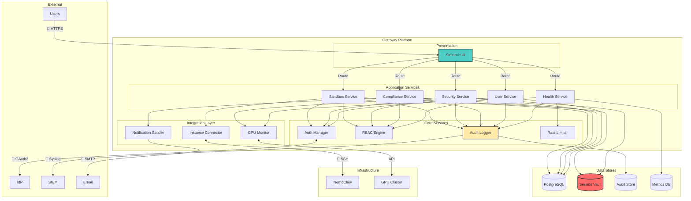

# NemoClaw Enterprise Command Center - Architecture Overview

**Document Version**: 2.1.0  
**Classification**: Internal Use  
**Last Updated**: March 27, 2026  
**Authors**: Architecture Team, Security Team

---

## 1. Executive Summary

NemoClaw Gateway is an **enterprise-grade, secure control plane** for managing NVIDIA NemoClaw and OpenShell AI environments. The system implements a **zero-trust architecture** with defense-in-depth security, comprehensive audit logging, and self-assessment capabilities.

### Key Architectural Principles

| Principle | Implementation |
|-----------|----------------|
| **Zero Trust** | No implicit trust; every request authenticated and authorized |
| **Defense in Depth** | Multiple security layers (WAF, Auth, RBAC, Encryption, Audit) |
| **Least Privilege** | Granular permissions; users have minimum required access |
| **Immutable Audit** | Tamper-proof audit logs with cryptographic signatures |
| **Self-Healing** | Health monitoring with anomaly detection and remediation |
| **Fail-Closed** | Security failures block access rather than allow it |

---

## 2. High-Level Architecture

### 2.1 System Context

```
┌─────────────────────────────────────────────────────────────────────────┐
│                           EXTERNAL ENTITIES                              │
│  ┌──────────┐  ┌──────────┐  ┌──────────┐  ┌──────────┐               │
│  │ Engineers│  │ SecOps   │  │ CISO     │  │ Admins   │               │
│  └────┬─────┘  └────┬─────┘  └────┬─────┘  └────┬─────┘               │
└───────┼─────────────┼─────────────┼─────────────┼───────────────────────┘
        │             │             │             │
        ▼             ▼             ▼             ▼
┌─────────────────────────────────────────────────────────────────────────┐
│                      SECURITY PERIMETER (WAF + DDoS)                   │
│                         🔐 TLS 1.3 Termination                          │
└─────────────────────────────────────────────────────────────────────────┘
        │
        ▼
┌─────────────────────────────────────────────────────────────────────────┐
│                         NEMOCLAW GATEWAY PLATFORM                        │
│                                                                          │
│  ┌───────────────────────────────────────────────────────────────────┐  │
│  │                    PRESENTATION LAYER                              │  │
│  │  ┌────────────┐  ┌────────────┐  ┌────────────┐  ┌───────────┐  │  │
│  │  │ Engineer   │  │ SecOps     │  │ CISO       │  │ Admin     │  │  │
│  │  │ Dashboard  │  │ Dashboard  │  │ Dashboard  │  │ Panel     │  │  │
│  │  └────────────┘  └────────────┘  └────────────┘  └───────────┘  │  │
│  └───────────────────────────────────────────────────────────────────┘  │
│                              ▼                                          │
│  ┌───────────────────────────────────────────────────────────────────┐  │
│  │                   APPLICATION LAYER                              │  │
│  │  ┌────────────┐  ┌────────────┐  ┌────────────┐  ┌───────────┐  │  │
│  │  │ Sandbox    │  │ Security   │  │ Compliance │  │ User      │  │  │
│  │  │ Service    │  │ Service    │  │ Service    │  │ Service   │  │  │
│  │  └────────────┘  └────────────┘  └────────────┘  └───────────┘  │  │
│  │  ┌────────────┐  ┌────────────┐                                 │  │
│  │  │ Health     │  │ Audit      │                                 │  │
│  │  │ Monitor    │  │ Logger     │                                 │  │
│  │  └────────────┘  └────────────┘                                 │  │
│  └───────────────────────────────────────────────────────────────────┘  │
│                              ▼                                          │
│  ┌───────────────────────────────────────────────────────────────────┐  │
│  │                    SERVICE LAYER                                 │  │
│  │  ┌────────────┐  ┌────────────┐  ┌────────────┐  ┌───────────┐  │  │
│  │  │ Instance   │  │ GPU        │  │ Auth       │  │ Tenant    │  │  │
│  │  │ Manager    │  │ Monitor    │  │ Manager    │  │ Manager   │  │  │
│  │  └────────────┘  └────────────┘  └────────────┘  └───────────┘  │  │
│  └───────────────────────────────────────────────────────────────────┘  │
└─────────────────────────────────────────────────────────────────────────┘
        │
        ▼
┌─────────────────────────────────────────────────────────────────────────┐
│                      DATA LAYER                                          │
│  ┌────────────┐  ┌────────────┐  ┌────────────┐  ┌──────────────┐   │
│  │ PostgreSQL │  │ Secrets    │  │ Audit      │  │ Metrics      │   │
│  │ (App Data) │  │ Vault      │  │ Store      │  │ Store        │   │
│  │ 🔒 Encrypted│  │ 🔒 Encrypted│  │ 📝 Signed  │  │ 📊 Time-Series│   │
│  └────────────┘  └────────────┘  └────────────┘  └──────────────┘   │
└─────────────────────────────────────────────────────────────────────────┘
        │
        ▼
┌─────────────────────────────────────────────────────────────────────────┐
│                    INFRASTRUCTURE LAYER                                  │
│  ┌────────────┐  ┌────────────┐  ┌────────────┐  ┌──────────────┐     │
│  │ NemoClaw   │  │ OpenShell  │  │ GPU        │  │ External     │     │
│  │ Instances  │  │ CLI        │  │ Clusters   │  │ Services     │     │
│  └────────────┘  └────────────┘  └────────────┘  └──────────────┘     │
└─────────────────────────────────────────────────────────────────────────┘
```

### 2.2 Component Interaction



---

## 3. Deep-Dive Architecture

### 3.1 Authentication & Authorization Flow

```
┌─────────────────────────────────────────────────────────────────────────┐
│                    AUTHENTICATION SEQUENCE                               │
└─────────────────────────────────────────────────────────────────────────┘

  User          Gateway          Auth Service         Identity Provider
    │               │                    │                     │
    │ 1. POST /login│                    │                     │
    │──────────────>│                    │                     │
    │   {email,pwd} │                    │                     │
    │               │ 2. Validate Format │                     │
    │               │─────┐              │                     │
    │               │     │ S4: Input    │                     │
    │               │<────┘ Validation   │                     │
    │               │                    │                     │
    │               │ 3. Check Cache     │                     │
    │               │─────┐              │                     │
    │               │     │ Redis        │                     │
    │               │<────┘ {hash,salt} │                     │
    │               │                    │                     │
    │               │ 4. Verify Password │                     │
    │               │─────┐              │                     │
    │               │     │ PBKDF2       │                     │
    │               │<────┘ Compare      │                     │
    │               │                    │                     │
    │               │ 5. Check MFA       │                     │
    │               │───────────────────>│                     │
    │ 6. MFA Code   │                    │                     │
    │<──────────────│                    │                     │
    │ 7. Submit MFA │                    │                     │
    │──────────────>│                    │                     │
    │               │───────────────────>│ 8. Validate TOTP    │
    │               │                    │────────────────────>│
    │               │                    │<────────────────────│
    │               │                    │ 9. Valid/Invalid    │
    │               │<───────────────────│                     │
    │               │                    │                     │
    │               │ 10. Create Session │                     │
    │               │─────┐              │                     │
    │               │     │ JWT + Redis  │                     │
    │               │<────┘ Store        │                     │
    │               │                    │                     │
    │               │ 11. Log Audit      │                     │
    │               │──────────┐       │                     │
    │               │          │ Write │                     │
    │               │<─────────┘ Audit │                     │
    │               │                    │                     │
    │ 12. Token     │                    │                     │
    │<──────────────│                    │                     │
    │   {jwt_token} │                    │                     │
    │               │                    │                     │
```

### 3.2 Sandbox Lifecycle Management

```
┌─────────────────────────────────────────────────────────────────────────┐
│                   SANDBOX LIFECYCLE FLOW                                │
└─────────────────────────────────────────────────────────────────────────┘

  User          Gateway          Sandbox Service      Instance Manager
    │               │                    │                     │
    │ 1. Create Req │                    │                     │
    │──────────────>│                    │                     │
    │               │ 2. Auth + RBAC     │                     │
    │               │─────┐              │                     │
    │               │     │ Check        │                     │
    │               │<────┘ Permissions  │                     │
    │               │                    │                     │
    │               │ 3. Validate Config│                     │
    │               │─────┐              │                     │
    │               │     │ Schema       │                     │
    │               │<────┘ Validation   │                     │
    │               │                    │                     │
    │               │ 4. Allocate        │                     │
    │               │───────────────────>│                     │
    │               │                    │ 5. Get Instance     │
    │               │                    │────────────────────>│
    │               │                    │<────────────────────│
    │               │                    │ 6. Instance Config  │
    │               │                    │                     │
    │               │                    │ 7. Create Sandbox   │
    │               │                    │─────┐               │
    │               │                    │     │ SSH/OpenShell │
    │               │                    │<────┘ Execute       │
    │               │                    │                     │
    │               │ 8. Log Success     │                     │
    │               │─────┐              │                     │
    │               │     │ Audit        │                     │
    │               │<────┘ Write        │                     │
    │               │                    │                     │
    │ 9. Response   │                    │                     │
    │<──────────────│                    │                     │
    │ {sandbox_id}  │                    │                     │
    │               │                    │                     │
```

### 3.3 Security Event Processing

```
┌─────────────────────────────────────────────────────────────────────────┐
│                    SECURITY EVENT PIPELINE                              │
└─────────────────────────────────────────────────────────────────────────┘

  Sources               Detection              Analysis               Action
    │                      │                     │                     │
    │                      │                     │                     │
  ┌─┴─┐                  ┌─┴─┐               ┌─┴─┐                 ┌─┴─┐
  │Sandbox│                │Request│             │Risk    │           │Policy  │
  │Agent  │───Network────>│Filter │───Score───>│Engine  │──Rule───>│Enforcer│
  │       │   Request      │       │   (0-100)   │        │         │        │
  └─┬─┘                  └─┬─┘               └─┬─┘                 └─┬─┘
    │                      │                     │                     │
  ┌─┴─┐                  ┌─┴─┐               ┌─┴─┐                 ┌─┴─┐
  │System │                │Anomaly│             │Threat  │           │Alert   │
  │Monitor│───Metrics────>│Detect │───Class───>│Intel   │──Export─>│Notify  │
  │       │               │       │   (Sev)       │        │         │        │
  └─┬─┘                  └─┬─┘               └─┬─┘                 └─┬─┘
    │                      │                     │                     │
    │                      │                     │                     │
    └──────────────────────┴─────────────────────┴─────────────────────┘
                              │
                              ▼
                    ┌─────────────────┐
                    │   Audit Logger  │
                    │   📝 Immutable  │
                    └─────────────────┘
```

### 3.4 Health Monitoring Architecture

```
┌─────────────────────────────────────────────────────────────────────────┐
│                    HEALTH MONITORING SYSTEM                             │
└─────────────────────────────────────────────────────────────────────────┘

┌─────────────────┐    ┌─────────────────┐    ┌─────────────────┐
│   Scheduler     │    │   Check Runner  │    │   Collector     │
│   (Cron/Task)   │───>│   (Thread Pool) │───>│   (Aggregator)  │
└─────────────────┘    └─────────────────┘    └─────────────────┘
        │                                            │
        │                    ┌─────────────────┐     │
        │                    │   7 Health      │     │
        └───────────────────>│   Check Types   │<────┘
                             │                 │
                             │ • Service       │
                             │ • Config        │
                             │ • Access Control│
                             │ • Dependencies  │
                             │ • Data Flow     │
                             │ • Performance   │
                             │ • Security      │
                             └─────────────────┘
                                      │
                                      ▼
                             ┌─────────────────┐
                             │   Anomaly       │
                             │   Detector      │
                             │   (ML/Rule)     │
                             └─────────────────┘
                                      │
                    ┌─────────────────┼─────────────────┐
                    │                 │                 │
                    ▼                 ▼                 ▼
            ┌───────────┐    ┌───────────┐    ┌───────────┐
            │  Baseline │    │  Evidence │    │  Alert    │
            │  Compare  │    │  Capture  │    │  Generate │
            └───────────┘    └───────────┘    └───────────┘
                                                 │
                    ┌────────────────────────────┼────────────────────────────┐
                    │                            │                            │
                    ▼                            ▼                            ▼
            ┌───────────┐              ┌───────────┐              ┌───────────┐
            │  Report     │              │  Sign &   │              │  Export   │
            │  Builder    │              │  Hash     │              │  Format   │
            │             │              │ (HMAC)    │              │           │
            └───────────┘              └───────────┘              └───────────┘
                    │                            │                            │
                    └────────────────────────────┴────────────────────────────┘
                                                 │
                                                 ▼
                                      ┌─────────────────┐
                                      │   Immutable     │
                                      │   Report Store  │
                                      └─────────────────┘
```

---

## 4. Security Architecture

### 4.1 Defense in Depth

```
┌─────────────────────────────────────────────────────────────────────────┐
│                    SECURITY LAYERS (Outside-In)                         │
└─────────────────────────────────────────────────────────────────────────┘

Layer 1: Perimeter
┌─────────────────────────────────────────────────────────────────────────┐
│  • DDoS Protection (Cloudflare/AWS Shield)                                │
│  • Web Application Firewall (OWASP Rules)                               │
│  • Geo-blocking & IP Whitelisting                                       │
└─────────────────────────────────────────────────────────────────────────┘
                                    │
                                    ▼
Layer 2: Transport
┌─────────────────────────────────────────────────────────────────────────┐
│  • TLS 1.3 (Mandatory)                                                  │
│  • HSTS Headers                                                         │
│  • Certificate Pinning                                                │
│  • mTLS for Internal Services                                           │
└─────────────────────────────────────────────────────────────────────────┘
                                    │
                                    ▼
Layer 3: Authentication
┌─────────────────────────────────────────────────────────────────────────┐
│  • Multi-Factor Authentication (MFA)                                    │
│  • OAuth2 / SAML 2.0 SSO Integration                                    │
│  • JWT Tokens with Short Expiry                                         │
│  • Session Management & Rotation                                        │
└─────────────────────────────────────────────────────────────────────────┘
                                    │
                                    ▼
Layer 4: Authorization
┌─────────────────────────────────────────────────────────────────────────┐
│  • Role-Based Access Control (RBAC)                                     │
│  • 15 Granular Permissions                                              │
│  • Resource-Level Access Control                                        │
│  • Dynamic Policy Enforcement                                           │
└─────────────────────────────────────────────────────────────────────────┘
                                    │
                                    ▼
Layer 5: Application
┌─────────────────────────────────────────────────────────────────────────┐
│  • Input Validation & Sanitization                                      │
│  • Rate Limiting (60 req/min)                                           │
│  • CSRF Protection                                                      │
│  • Output Encoding                                                      │
└─────────────────────────────────────────────────────────────────────────┘
                                    │
                                    ▼
Layer 6: Data
┌─────────────────────────────────────────────────────────────────────────┐
│  • Encryption at Rest (AES-256)                                         │
│  • Encryption in Transit (TLS 1.3)                                      │
│  • Secrets Management (HashiCorp Vault)                                 │
│  • Data Classification & Labeling                                       │
└─────────────────────────────────────────────────────────────────────────┘
                                    │
                                    ▼
Layer 7: Audit
┌─────────────────────────────────────────────────────────────────────────┐
│  • Immutable Audit Logs                                                 │
│  • Cryptographic Signatures (HMAC)                                      │
│  • Real-time SIEM Export                                                │
│  • Tamper Detection                                                     │
└─────────────────────────────────────────────────────────────────────────┘
```

### 4.2 Trust Boundaries

| Boundary | Zone | Security Level | Access Requirements |
|----------|------|----------------|---------------------|
| **External** | Public Internet | 🔴 Untrusted | TLS 1.3, Valid Certificates |
| **DMZ** | WAF/Load Balancer | 🟡 Semi-Trusted | mTLS, Service Tokens |
| **Application** | Gateway Services | 🟢 Trusted | Service Mesh, RBAC |
| **Data** | Databases/Vaults | 🔒 Secure | Internal Network Only, Encryption |
| **Audit** | Audit Store | 📝 Immutable | Append-only, Signed |

---

## 5. Data Architecture

### 5.1 Data Classification

| Level | Data Types | Encryption | Retention |
|-------|------------|------------|-----------|
| **Public** | Documentation, marketing | None | 1 year |
| **Internal** | Configs, non-sensitive logs | 🔒 AES-256 | 90 days |
| **Confidential** | User data, sandbox configs | 🔒 AES-256 + Access Control | 2 years |
| **Restricted** | Passwords, API keys, tokens | 🔒 Vault + Encryption | Until rotation |
| **Audit** | Security events, compliance | 📝 Immutable + Signed | 7 years |

### 5.2 Data Flow Patterns

```
Write Path:
Application → Input Validation → Business Logic → Audit Log → Database
                                    │
                                    └──> Cache Update

Read Path:
Application → Cache Check → Database → Response
                │
                └──> Cache Hit (Fast)

Export Path:
Database → Sanitization → Encryption → SIEM/API
```

---

## 6. Operational Architecture

### 6.1 Deployment Topology

```
┌─────────────────────────────────────────────────────────────────────────┐
│                    MULTI-REGION DEPLOYMENT                               │
└─────────────────────────────────────────────────────────────────────────┘

Region: US-East-1 (Primary)
┌─────────────────────────────────────────────────────────────────────────┐
│  ┌─────────────┐  ┌─────────────┐  ┌─────────────┐  ┌─────────────┐   │
│  │   App       │  │   App       │  │   App       │  │   App       │   │
│  │   Server 1  │  │   Server 2  │  │   Server 3  │  │   Server N  │   │
│  │   (K8s Pod) │  │   (K8s Pod) │  │   (K8s Pod) │  │   (K8s Pod) │   │
│  └──────┬──────┘  └──────┬──────┘  └──────┬──────┘  └──────┬──────┘   │
│         │                │                │                │           │
│         └────────────────┴────────────────┴────────────────┘           │
│                                     │                                   │
│                              Load Balancer                               │
│                                     │                                   │
│  ┌─────────────────────────────────────────────────────────────────┐   │
│  │                    PostgreSQL (Primary)                          │   │
│  │              🔒 Encrypted + Read Replicas                       │   │
│  └─────────────────────────────────────────────────────────────────┘   │
│                                                                     │   │
│  ┌─────────────────┐  ┌─────────────────┐  ┌─────────────────┐   │   │
│  │   Redis Cache   │  │   Vault         │  │   Prometheus    │   │   │
│  │   (Session)     │  │   (Secrets)     │  │   (Metrics)     │   │   │
│  └─────────────────┘  └─────────────────┘  └─────────────────┘   │   │
└─────────────────────────────────────────────────────────────────────────┘

Region: EU-West-1 (DR/Secondary)
┌─────────────────────────────────────────────────────────────────────────┐
│  ┌─────────────┐  ┌─────────────────────────────────────────────────┐   │
│  │   Read-Only │  │                    PostgreSQL                    │   │
│  │   App       │  │              🔒 Encrypted Replica                │   │
│  │   Server    │  │              Async Replication                   │   │
│  └─────────────┘  └─────────────────────────────────────────────────┘   │
└─────────────────────────────────────────────────────────────────────────┘

Replication: Async PostgreSQL Streaming + Redis Sentinel
Failover: Automatic with 30-second RPO
```

### 6.2 Monitoring & Observability

```
┌─────────────────────────────────────────────────────────────────────────┐
│                    OBSERVABILITY STACK                                  │
└─────────────────────────────────────────────────────────────────────────┘

Metrics Collection:
┌─────────────┐  ┌─────────────┐  ┌─────────────┐
│ Application │  │ System      │  │ Security    │
│ (Prometheus │  │ (Node       │  │ (Audit      │
│  Client)    │  │  Exporter)  │  │  Events)    │
└──────┬──────┘  └──────┬──────┘  └──────┬──────┘
       │                │                │
       └────────────────┴────────────────┘
                          │
                          ▼
              ┌─────────────────┐
              │   Prometheus    │
              │   (Time-Series) │
              └────────┬────────┘
                       │
          ┌────────────┼────────────┐
          │            │            │
          ▼            ▼            ▼
   ┌──────────┐ ┌──────────┐ ┌──────────┐
   │ Grafana  │ │ Alert    │ │ SIEM     │
   │ Dashboard│ │ Manager  │ │ Export   │
   └──────────┘ └──────────┘ └──────────┘

Log Aggregation:
┌─────────────┐  ┌─────────────┐  ┌─────────────┐
│ Application │  │ System      │  │ Security    │
│ (Structured │  │ (Journald/  │  │ (Audit      │
│  JSON)      │  │  Syslog)    │  │  Logs)      │
└──────┬──────┘  └──────┬──────┘  └──────┬──────┘
       │                │                │
       └────────────────┴────────────────┘
                          │
                          ▼
              ┌─────────────────┐
              │   Fluentd/      │
              │   Vector        │
              └────────┬────────┘
                       │
                       ▼
              ┌─────────────────┐
              │   Elasticsearch │
              │   / OpenSearch  │
              └────────┬────────┘
                       │
                       ▼
              ┌─────────────────┐
              │   Kibana        │
              │   (Log UI)      │
              └─────────────────┘
```

---

## 7. API Architecture

### 7.1 API Gateway Pattern

```
┌─────────────────────────────────────────────────────────────────────────┐
│                    API GATEWAY LAYER                                    │
└─────────────────────────────────────────────────────────────────────────┘

Client Request
      │
      ▼
┌─────────────────────────────────────┐
│  1. Rate Limiting (60 req/min)      │
│     ↓ Token Bucket Algorithm        │
└─────────────────────────────────────┘
      │
      ▼
┌─────────────────────────────────────┐
│  2. Authentication (JWT Verify)     │
│     ↓ Validate Signature            │
│     ↓ Check Expiry                  │
│     ↓ Verify Issuer                 │
└─────────────────────────────────────┘
      │
      ▼
┌─────────────────────────────────────┐
│  3. Authorization (RBAC Check)      │
│     ↓ Load User Permissions         │
│     ↓ Check Resource Access         │
│     ↓ Verify Action Allowed         │
└─────────────────────────────────────┘
      │
      ▼
┌─────────────────────────────────────┐
│  4. Input Validation                │
│     ↓ Schema Validation             │
│     ↓ Sanitization                  │
│     ↓ Size Limits                   │
└─────────────────────────────────────┘
      │
      ▼
┌─────────────────────────────────────┐
│  5. Request Routing                 │
│     ↓ Path Matching                 │
│     ↓ Service Discovery             │
│     ↓ Load Balancing                │
└─────────────────────────────────────┘
      │
      ▼
Backend Service
      │
      ▼
┌─────────────────────────────────────┐
│  6. Response Processing               │
│     ↓ Transform                     │
│     ↓ Cache Headers                 │
│     ↓ Security Headers              │
└─────────────────────────────────────┘
      │
      ▼
Client Response
```

### 7.2 Service Communication

| Pattern | Use Case | Implementation |
|---------|----------|----------------|
| **Sync HTTP** | User-facing APIs | REST with JSON |
| **Async Message** | Background jobs | Redis Streams |
| **Event Streaming** | Audit logs, metrics | WebSocket/SSE |
| **gRPC** | Internal service mesh | Protocol Buffers |

---

## 8. Disaster Recovery

### 8.1 Backup Strategy

| Component | Frequency | Retention | Method |
|-----------|-----------|-----------|--------|
| **Database** | Hourly | 30 days | WAL archiving + Full weekly |
| **Configuration** | On change | 90 days | Git + Encrypted S3 |
| **Secrets** | Daily | 7 days | Vault snapshot |
| **Audit Logs** | Real-time | 7 years | Immutable S3 |

### 8.2 Recovery Objectives

- **RPO (Recovery Point Objective)**: 5 minutes (async replication)
- **RTO (Recovery Time Objective)**: 15 minutes (automated failover)
- **Backup Test Frequency**: Monthly

---

## 9. Compliance Architecture

### 9.1 Compliance Mapping

```
┌─────────────────────────────────────────────────────────────────────────┐
│                    COMPLIANCE CONTROLS                                  │
└─────────────────────────────────────────────────────────────────────────┘

SOC 2 Type II:
├── CC6.1 - Logical Access Security        → RBAC + MFA
├── CC6.2 - Prior to Access                → Approval workflows
├── CC6.3 - Access Removal                 → Automated deprovisioning
├── CC7.1 - Security Operations            → Security Service + Alerts
├── CC7.2 - System Monitoring              → Health Monitor + SIEM
└── CC7.3 - Security Incident Detection    → Anomaly Detection

GDPR:
├── Article 25 - Data Protection by Design → Encryption + Pseudonymization
├── Article 30 - Records of Processing     → Audit Logs
├── Article 32 - Security of Processing    → All security layers
└── Article 33 - Breach Notification       → Automated alerting

ISO 27001:
├── A.9.1.1 - Access Control Policy        → RBAC Policy Engine
├── A.9.4.1 - Use of Secret Authentication → Vault + MFA
├── A.12.3.1 - Information Backup          → Automated backups
├── A.12.4.1 - Event Logging               → Immutable audit
└── A.16.1.1 - Incident Management         → Alert pipeline

NIST CSF:
├── ID.AM-1 - Inventory Management         → Asset discovery
├── PR.AC-1 - Identity Management          → Auth Service
├── PR.DS-1 - Data-at-rest Protection      → Encryption
├── DE.AE-1 - Anomaly Detection            → Health Monitor
└── RS.RP-1 - Response Plan Execution      → Automated remediation
```

---

## 10. Version History

| Version | Date | Changes | Author |
|---------|------|---------|--------|
| **2.1.0** | 2024-03-27 | Added Health Monitoring architecture, updated security diagrams | Architecture Team |
| **2.0.0** | 2024-03-27 | Phase 4 complete: Multi-tenancy, SSO, audit export | Architecture Team |
| **1.3.0** | 2024-03-27 | Phase 3 complete: CISO view, compliance, audit | Architecture Team |
| **1.2.0** | 2024-03-27 | Phase 2 complete: SecOps, security, alerts | Architecture Team |
| **1.1.0** | 2024-03-27 | Phase 1 complete: Engineer view, sandbox management | Architecture Team |
| **1.0.0** | 2024-03-26 | Initial architecture design | Architecture Team |

---

**Classification**: Internal Use  
**Owner**: Security Architecture Team  
**Review Cycle**: Quarterly  
**Next Review**: June 27, 2026

---

*End of Document*
