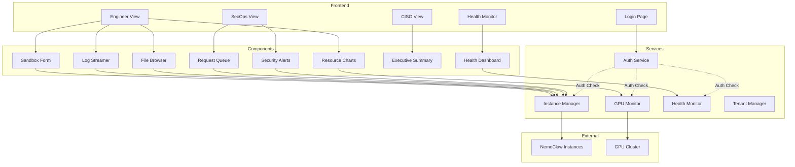

# NemoClaw Enterprise Command Center - Component Documentation

**Version**: 2.1.0  
**Classification**: Internal Use  
**Last Updated**: March 27, 2026

---

## 1. Enterprise Component Overview

The NemoClaw Enterprise Gateway follows a **layered architecture** with clear separation of concerns:

```
┌─────────────────────────────────────────┐
│         Presentation Layer              │
│  (Streamlit Pages, Dashboards)           │
├─────────────────────────────────────────┤
│         Application Layer               │
│  (Components: Forms, Charts, UI)       │
├─────────────────────────────────────────┤
│         Service Layer                   │
│  (Business Logic, Core Services)         │
├─────────────────────────────────────────┤
│         Infrastructure Layer            │
│  (External APIs, Databases)              │
└─────────────────────────────────────────┘
```

---

## 2. Presentation Layer Components

### 2.1 Page Components

#### `pages/00_Login.py` - Authentication Portal

**Purpose**: User authentication and session establishment

**Features**:
- Email/password authentication
- OAuth2/SAML SSO integration (mocked)
- Demo mode for quick role-based login
- MFA support (framework ready)

**Security Controls**:
- Input validation for email format
- Password masking
- Rate limiting hooks (to be implemented)
- Session initialization

**Dependencies**:
- `services.auth_service`
- `streamlit`

**Data Flow**:
```
User Input → Validation → Auth Manager → Session Creation → Redirect
```

---

#### `pages/01_Engineer_View.py` - Engineer Dashboard

**Purpose**: Sandbox management and resource monitoring for engineers

**Features**:
- Sandbox creation wizard
- Lifecycle controls (start/stop/restart)
- Real-time log streaming
- GPU telemetry visualization
- Resource mini-charts (CPU, memory, disk, network)
- Workspace file browser

**Tabs**:
1. **Sandbox Management** - Create, control, monitor sandboxes
2. **GPU Telemetry** - Real-time GPU metrics with Plotly gauges
3. **Log Streaming** - Live log viewing with pause/resume
4. **Resources** - System resource monitoring

**Security Controls**:
- ✅ Authentication check
- 🛡️ Role-based access (Engineer, SecOps, CISO, Admin)
- 📝 Audit logging for all sandbox operations

**Dependencies**:
- `components.sandbox_form`
- `components.log_streamer`
- `components.file_browser`
- `components.resource_charts`
- `services.instance_manager`
- `services.gpu_monitor`

---

#### `pages/02_SecOps_View.py` - Security Operations Center

**Purpose**: Security monitoring, request approval, and threat detection

**Features**:
- Network request queue with risk scoring
- Agent reputation dashboard
- Security alerts with severity classification
- Policy violation tracking
- Quick emergency actions

**Tabs**:
1. **Request Queue** - Approve/deny network requests
2. **Agent Reputation** - Track agent behavior scores
3. **Security Alerts** - Real-time threat detection
4. **Policy Violations** - Compliance violations

**Security Controls**:
- ✅ Authentication required
- 🛡️ SecOps role or higher required
- 📝 All actions audit-logged
- 🔐 All security events tracked

**Dependencies**:
- `components.request_queue`
- `components.agent_reputation`
- `components.security_alerts`

---

#### `pages/03_CISO_View.py` - Executive Dashboard

**Purpose**: Executive reporting, compliance monitoring, and governance

**Features**:
- Executive summary with KPIs
- Security scorecard with visualizations
- Compliance framework tracking
- Audit trail viewer
- Policy management interface

**Tabs**:
1. **Executive Summary** - High-level metrics and trends
2. **Security Scorecard** - Domain-based security posture
3. **Compliance Overview** - SOC2, GDPR, ISO27001, NIST tracking
4. **Audit Trail** - Forensic event viewing
5. **Policy Management** - Security policy configuration

**Security Controls**:
- ✅ CISO/Admin roles only
- 🛡️ Read-heavy permissions
- 📝 Audit access logged
- 🔐 Sensitive data access tracked

**Dependencies**:
- `components.executive_summary`
- `components.security_scorecard`
- `components.compliance_overview`
- `components.audit_trail`
- `components.policy_management`

---

#### `pages/04_Settings.py` - Instance Management

**Purpose**: Configure and manage NemoClaw/OpenShell instances

**Features**:
- Add new instances
- Edit instance configuration
- Test connectivity
- View instance health status

**Security Controls**:
- ✅ Admin role required
- 🛡️ System-level permissions
- 📝 All configuration changes logged
- 🔐 API keys stored in secrets vault

**Dependencies**:
- `services.instance_manager`
- `services.openshell`

---

#### `pages/05_Health_Monitor.py` - System Health Dashboard

**Purpose**: Self-assessment and operational integrity monitoring

**Features**:
- Real-time health checks
- Anomaly detection display
- Remediation suggestions
- Export capabilities (JSON/text)
- Auto-refresh option

**Security Controls**:
- ✅ Any authenticated user
- 🛡️ Least-privilege health checks
- 📝 Health assessments logged
- 🔐 Reports cryptographically signed

**Dependencies**:
- `components.health_dashboard`
- `services.health_monitor`
- `services.health_checks`

---

### 2.2 UI Components

#### `components/sandbox_form.py` - Sandbox Creation Wizard

**Purpose**: Guided sandbox creation with validation

**Classes/Functions**:
- `render_sandbox_form()` - Multi-step creation form
- `render_quick_create()` - Simplified single-step form
- `validate_sandbox_config()` - Configuration validation

**Security Controls**:
- Input sanitization for sandbox names
- Resource limit validation
- User permission checks

**Data Inputs**:
- Sandbox name (validated: `[a-zA-Z0-9_-]{3,64}`)
- GPU requirements
- Resource limits (CPU, memory, storage)
- Environment variables

---

#### `components/file_browser.py` - Workspace File Manager

**Purpose**: Browse, upload, and download files in sandbox workspaces

**Functions**:
- `render_file_browser()` - File tree navigation
- `upload_file()` - Secure file upload
- `download_file()` - File download
- `delete_file()` - File deletion

**Security Controls**:
- Path traversal prevention
- File type restrictions
- Size limits
- Audit logging for file operations

**Constraints**:
- Max file size: 100MB
- Allowed extensions: configurable
- No executable uploads

---

#### `components/log_streamer.py` - Real-time Log Viewer

**Purpose**: Stream and display sandbox logs in real-time

**Features**:
- Thread-based log streaming
- Pause/resume functionality
- Auto-scroll toggle
- Log filtering

**Security Controls**:
- Rate limiting on log access
- Sensitive data masking (passwords, tokens)
- Access logging

**Technical Details**:
- Background thread for streaming
- Thread-safe queue for UI updates
- Automatic cleanup on stop

---

#### `components/resource_charts.py` - Resource Visualization

**Purpose**: Display system resource metrics using Plotly

**Charts**:
- CPU utilization gauge
- Memory usage gauge
- Disk usage gauge
- Network I/O charts

**Data Sources**:
- psutil (system metrics)
- pynvml (GPU metrics)
- Custom metrics from instances

---

#### `components/request_queue.py` - Network Request Management

**Purpose**: Display and manage network request approvals

**Features**:
- Request listing with filters
- Risk score display (0-100)
- Approve/deny actions
- Bulk operations
- Request detail view

**Security Controls**:
- Approval requires SecOps+ role
- All decisions logged
- Risk factors explained

---

#### `components/agent_reputation.py` - Agent Behavior Tracking

**Purpose**: Display agent reputation scores and trends

**Visualizations**:
- Reputation score trend chart
- Risk factor breakdown
- Historical analysis

**Data Model**:
- Agent ID
- Current score (0-100)
- Risk factors
- Score history

---

#### `components/security_alerts.py` - Threat Detection Display

**Purpose**: Real-time security alert monitoring

**Features**:
- Alert listing with severity
- Alert acknowledgment
- Filter by severity/type
- Alert detail view
- Evidence display

**Alert Severities**:
- Critical (immediate action)
- High (urgent attention)
- Medium (scheduled review)
- Low (informational)

---

#### `components/executive_summary.py` - Executive KPI Dashboard

**Purpose**: High-level security and compliance metrics for executives

**Metrics**:
- Security posture score
- Active incidents
- Compliance status
- Resource utilization
- 30-day trends

**Visualizations**:
- Summary cards
- Trend charts
- Quick insights

---

#### `components/security_scorecard.py` - Security Posture Visualization

**Purpose**: Detailed security domain analysis

**Features**:
- Radar chart for security domains
- Risk matrix (probability vs impact)
- Risk register table

**Security Domains**:
- Access Control
- Data Protection
- Network Security
- Monitoring
- Incident Response

---

#### `components/compliance_overview.py` - Compliance Tracking

**Purpose**: Monitor compliance with security frameworks

**Frameworks**:
- SOC 2 Type II
- GDPR
- ISO 27001
- NIST CSF

**Features**:
- Framework status dashboard
- Control compliance matrix
- Audit schedule
- Evidence management

---

#### `components/audit_trail.py` - Audit Event Viewer

**Purpose**: Forensic audit log viewing and analysis

**Features**:
- Event timeline
- Filtering by type/severity/user
- Event details
- Export capabilities

**Event Types**:
- User actions (login, logout, CRUD)
- System events (start, stop, config changes)
- Security events (alerts, violations)

---

#### `components/policy_management.py` - Policy Configuration

**Purpose**: Configure and manage security policies

**Features**:
- Policy listing
- Policy creation wizard
- Enforcement mode selection
- Policy details

**Policy Types**:
- Network policies
- Access policies
- Data policies
- Resource policies
- Compliance policies
- Behavior policies

**Enforcement Modes**:
- Enforce (block violations)
- Audit (log only)
- Warn (alert but allow)
- Disabled (inactive)

---

#### `components/user_management.py` - User Administration

**Purpose**: Manage users, roles, and permissions

**Features**:
- User listing with filters
- Add/edit/deactivate users
- Role assignment
- Permission auditing

**Roles**:
- Admin (full access)
- CISO (security/compliance view)
- SecOps (security operations)
- Engineer (sandbox management)
- Viewer (read-only)

---

#### `components/audit_export.py` - Audit Log Export

**Purpose**: Export audit logs in various formats

**Formats**:
- JSON (SIEM integration)
- CSV (spreadsheet analysis)
- PDF (human-readable reports)
- Syslog (centralized logging)
- CEF (ArcSight, LogRhythm)
- LEEF (QRadar)

**Features**:
- Date range selection
- Filter by event type
- Scheduled reports

---

#### `components/health_dashboard.py` - Health Monitoring UI

**Purpose**: Visual interface for health monitoring

**Features**:
- Overall status indicator
- Status breakdown charts
- Anomaly display
- Check details
- Remediation suggestions
- Export options

**Visualizations**:
- Status pie chart
- Anomaly list
- Check result cards
- Metric trends

---

## 3. Service Layer Components

### 3.1 Core Services

#### `services/auth_service.py` - Authentication & Authorization

**Purpose**: Manage user authentication and access control

**Classes**:
- `AuthManager` - Central authentication service
- `UserRole` (Enum) - Role definitions
- `AuthProvider` (Enum) - Auth provider types
- `User` (dataclass) - User entity
- `Session` (dataclass) - Session entity

**Permissions** (15 total):
```python
VIEW_SANDBOXES, CREATE_SANDBOX, DELETE_SANDBOX, START_STOP_SANDBOX
VIEW_LOGS, VIEW_GPU_METRICS, VIEW_REQUEST_QUEUE, APPROVE_REQUESTS
VIEW_SECURITY_ALERTS, ACKNOWLEDGE_ALERTS, VIEW_COMPLIANCE
MANAGE_POLICIES, VIEW_AUDIT_TRAIL, MANAGE_USERS, SYSTEM_ADMIN
```

**Role Permissions Matrix**:

| Role | Permissions |
|------|-------------|
| Admin | All 15 permissions |
| CISO | 7 view-only permissions (audit, compliance, security) |
| SecOps | 7 permissions (alerts, requests, sandboxes) |
| Engineer | 6 permissions (sandbox management) |
| Viewer | 3 permissions (view sandboxes, logs, metrics) |

**Methods**:
- `authenticate(email, password)` - Local auth
- `authenticate_oauth(token, provider)` - SSO auth
- `has_permission(user, permission)` - Permission check
- `create_user(email, name, role)` - User creation
- `change_user_role(user_id, new_role)` - Role update

**Security Features**:
- Password hashing (PBKDF2 - to be implemented)
- Session management
- MFA support
- Audit logging

---

#### `services/instance_manager.py` - Instance Lifecycle Management

**Purpose**: Manage NemoClaw/OpenShell instances

**Class**: `InstanceManager`

**Methods**:
- `list_instances()` - Get all instances
- `get_instance(instance_id)` - Get specific instance
- `add_instance(config)` - Add new instance
- `check_health(instance_id)` - Health check
- `connect(instance_id)` - Establish connection

**Data Model**:
- Instance ID
- Name, host, port
- API credentials (stored in vault)
- Status (online/offline/error)
- GPU count
- Configuration

---

#### `services/openshell.py` - OpenShell CLI Wrapper

**Purpose**: Interface with OpenShell/NemoClaw CLI

**Class**: `OpenShellService`

**Methods**:
- `execute(command, instance_id)` - Execute CLI command
- `create_sandbox(config)` - Create sandbox
- `start_sandbox(sandbox_id)` - Start sandbox
- `stop_sandbox(sandbox_id)` - Stop sandbox
- `get_logs(sandbox_id, lines)` - Retrieve logs

**Security**:
- SSH key-based authentication
- Command validation
- Timeout handling
- Error sanitization

---

#### `services/gpu_monitor.py` - GPU Telemetry

**Purpose**: Monitor GPU metrics using NVML

**Class**: `GpuMonitor`

**Metrics**:
- Temperature (°C)
- Utilization (%)
- Memory usage (MB)
- Power draw (W)
- Fan speed (%)
- Clock speeds (MHz)

**Methods**:
- `get_gpu_metrics(instance_id)` - Get all GPU metrics
- `get_gpu_count()` - Number of GPUs
- `check_gpu_health()` - GPU health status

---

#### `services/tenant_manager.py` - Multi-tenancy Management

**Purpose**: Manage tenants, teams, and resource quotas

**Classes**:
- `Tenant` (dataclass) - Organization entity
- `Team` (dataclass) - Team entity
- `TenantManager` - Management service

**Tenant Tiers**:

| Tier | Instances | Users | Storage | Multi-Region | Advanced Security |
|------|-----------|-------|---------|--------------|-------------------|
| Starter | 3 | 10 | 100 GB | ❌ | ❌ |
| Professional | 10 | 50 | 500 GB | ✅ | ✅ |
| Enterprise | 100 | 500 | 5 TB | ✅ | ✅ |

**Methods**:
- `create_tenant(name, domain, tier)` - Create tenant
- `get_tenant(tenant_id)` - Get tenant
- `update_tenant_tier(tenant_id, new_tier)` - Upgrade/downgrade
- `create_team(tenant_id, name)` - Create team
- `get_usage_report(tenant_id)` - Resource usage

---

#### `services/health_monitor.py` - Health Monitoring Service

**Purpose**: Continuous self-assessment and anomaly detection

**Classes**:
- `SecureHealthMonitor` - Core monitoring service
- `HealthCheckResult` (dataclass) - Individual check result
- `HealthReport` (dataclass) - Complete health report
- `AnomalyEvent` (dataclass) - Detected anomaly

**Enums**:
- `HealthStatus` - healthy, degraded, critical, unknown
- `SeverityLevel` - info, low, medium, high, critical
- `CheckType` - service_availability, configuration_integrity, etc.

**Features**:
- Tamper-resistant reports (HMAC-SHA256)
- Integrity validation (SHA-256)
- Rate limiting (60 checks/minute)
- Execution isolation (threads)
- Audit logging

**Methods**:
- `run_assessment()` - Execute health checks
- `detect_anomalies(report)` - Find anomalies
- `get_remediation_suggestions(report)` - Safe recommendations
- `export_report_json(report)` - SIEM export
- `export_report_human(report)` - Human-readable

---

#### `services/health_checks.py` - Built-in Health Checks

**Purpose**: Pre-configured health checks for system components

**Checks** (7 total):

1. **check_service_availability()** - Core services online
2. **check_configuration_integrity()** - Config files valid
3. **check_access_control()** - Auth system working
4. **check_dependency_health()** - Required packages installed
5. **check_data_flow()** - Serialization working
6. **check_performance()** - Response times acceptable
7. **check_security_posture()** - Security settings correct

**Registration**:
```python
register_all_checks(health_monitor)  # Registers all 7 checks
```

---

### 3.2 Utility Services

#### `utils/config.py` - Configuration Management

**Purpose**: Load and manage application configuration

**Functions**:
- `load_config()` - Load YAML configuration
- `get_setting(key)` - Get specific setting
- `validate_config()` - Validate configuration

---

#### `utils/styling.py` - UI Styling Utilities

**Purpose**: Consistent UI theming and components

**Functions**:
- `apply_theme(theme_config)` - Apply theme
- `render_header(instance_manager)` - Render app header
- `render_card(title, content)` - Styled card component

---

#### `utils/error_handling.py` - Error Management

**Purpose**: Robust error handling and retry logic

**Classes**:
- `CircuitBreaker` - Fail-fast pattern
- `RetryHandler` - Exponential backoff

**Decorators**:
- `@retry(max_attempts, backoff)` - Retry decorator
- `@circuit_breaker(threshold, timeout)` - Circuit breaker decorator

---

#### `utils/security_hardening.py` - Security Utilities

**Purpose**: Security hardening utilities

**Classes**:
- `SecurityHardening` - Password hashing, validation
- `RateLimiter` - Request rate limiting
- `InputValidator` - Input sanitization

**Methods**:
- `hash_password(password)` - PBKDF2 hashing
- `verify_password(password, hash, salt)` - Password verification
- `sanitize_input(value)` - Input sanitization
- `validate_email(email)` - Email validation
- `validate_password_strength(password)` - Strength check

---

## 4. Data Layer

### 4.1 Data Models

See `docs/DATABASE_SCHEMA.md` for complete schema documentation.

**Key Entities**:
- Users & Sessions (Authentication)
- Tenants & Teams (Multi-tenancy)
- Instances & Sandboxes (Core Resources)
- Audit Logs (Compliance)
- Security Alerts (Monitoring)
- Health Reports (Operations)

### 4.2 Data Flow Summary

```
User Request
    ↓
Authentication (Auth Service)
    ↓
Authorization (RBAC Engine)
    ↓
Input Validation (Security Hardening)
    ↓
Business Logic (Service Layer)
    ↓
Audit Logging (Immutable Store)
    ↓
Database Operations (PostgreSQL)
    ↓
Response
```

---

## 5. Component Interaction Diagram



---

## 6. Component Dependencies

### Dependency Graph

```
app.py
├── pages/00_Login.py
│   └── services/auth_service.py
├── pages/01_Engineer_View.py
│   ├── components/sandbox_form.py
│   ├── components/log_streamer.py
│   ├── components/file_browser.py
│   ├── components/resource_charts.py
│   ├── services/instance_manager.py
│   └── services/gpu_monitor.py
├── pages/02_SecOps_View.py
│   ├── components/request_queue.py
│   ├── components/agent_reputation.py
│   ├── components/security_alerts.py
│   └── services/instance_manager.py
├── pages/03_CISO_View.py
│   ├── components/executive_summary.py
│   ├── components/security_scorecard.py
│   ├── components/compliance_overview.py
│   ├── components/audit_trail.py
│   └── components/policy_management.py
├── pages/04_Settings.py
│   └── services/instance_manager.py
└── pages/05_Health_Monitor.py
    ├── components/health_dashboard.py
    ├── services/health_monitor.py
    └── services/health_checks.py

services/auth_service.py
└── utils/security_hardening.py

services/health_monitor.py
└── utils/security_hardening.py

All pages
└── services/auth_service.py (require_auth)
```

---

## 7. Testing Components

### 7.1 Unit Testing

**Recommended Test Structure**:
```
tests/
├── unit/
│   ├── services/
│   │   ├── test_auth_service.py
│   │   ├── test_health_monitor.py
│   │   └── test_instance_manager.py
│   ├── components/
│   │   ├── test_sandbox_form.py
│   │   └── test_security_alerts.py
│   └── utils/
│       ├── test_security_hardening.py
│       └── test_error_handling.py
├── integration/
│   └── test_end_to_end.py
└── security/
    └── test_authentication.py
```

### 7.2 Component Test Examples

```python
# Example: Testing Auth Service
import pytest
from services.auth_service import AuthManager, UserRole

def test_authenticate_valid_user():
    auth = AuthManager()
    user = auth.authenticate("admin@company.com", "password")
    assert user is not None
    assert user.role == UserRole.ADMIN

def test_has_permission_admin():
    auth = AuthManager()
    user = auth._users["user-001"]
    assert auth.has_permission(user, "system_admin")

def test_rate_limiting():
    from utils.security_hardening import RateLimiter
    limiter = RateLimiter(max_requests=5, window_seconds=60)
    
    # Should allow 5 requests
    for i in range(5):
        assert limiter.is_allowed("test-key")
    
    # 6th request should be denied
    assert not limiter.is_allowed("test-key")
```

---

## 8. Performance Considerations

### 8.1 Component Performance Guidelines

| Component | Target Response | Optimization |
|-----------|----------------|--------------|
| **Auth Service** | < 100ms | Redis caching for sessions |
| **Health Monitor** | < 500ms | Async checks, caching |
| **GPU Monitor** | < 200ms | Cached metrics, 5s refresh |
| **File Browser** | < 300ms | Pagination, lazy loading |
| **Log Streamer** | Real-time | Background threads |

### 8.2 Caching Strategy

```python
# Session cache (Redis)
CACHE_TTL_SESSION = 3600  # 1 hour

# Health status cache
CACHE_TTL_HEALTH = 60  # 1 minute

# GPU metrics cache
CACHE_TTL_GPU = 5  # 5 seconds

# User permissions cache
CACHE_TTL_PERMISSIONS = 300  # 5 minutes
```

---

## 9. Security Checklist by Component

### 9.1 Authentication Components

- [ ] Password hashing (PBKDF2)
- [ ] Session timeout handling
- [ ] MFA verification
- [ ] Rate limiting on login
- [ ] Secure session tokens

### 9.2 Authorization Components

- [ ] RBAC checks on all endpoints
- [ ] Permission validation
- [ ] Resource-level access control
- [ ] Audit logging

### 9.3 Input Handling Components

- [ ] Input validation
- [ ] SQL injection prevention
- [ ] XSS prevention
- [ ] File upload restrictions
- [ ] Path traversal prevention

### 9.4 Data Access Components

- [ ] Encryption at rest
- [ ] Encryption in transit
- [ ] Secrets management
- [ ] Audit logging
- [ ] Data sanitization

---

## 10. Deployment Notes

### 10.1 Component Initialization Order

1. Configuration loading
2. Secrets vault connection
3. Database connection
4. Cache (Redis) connection
5. Auth service initialization
6. Health monitor registration
7. Web server startup

### 10.2 Health Check Endpoints

```python
# Health check endpoints for load balancers
HEALTH_ENDPOINTS = {
    "/health/live": "Liveness probe - app running",
    "/health/ready": "Readiness probe - dependencies OK",
    "/health/startup": "Startup probe - initialization complete"
}
```

---

**Version**: 2.1.0  
**Classification**: Internal Use  
**Next Review**: April 27, 2026

---

*End of Component Documentation*
