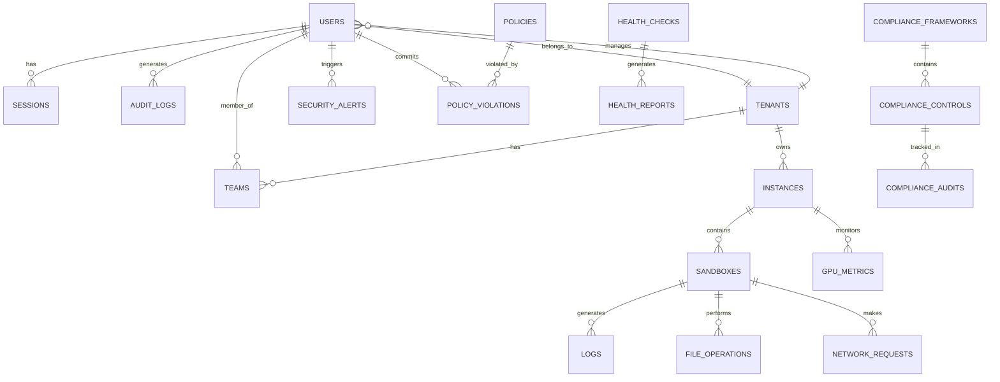
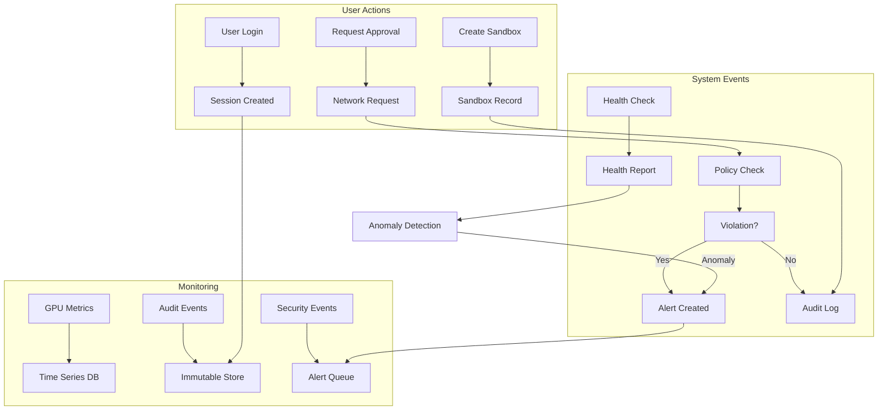

# NemoClaw Enterprise Command Center - Database Schema Documentation

**Document**: DDL/DML Schema Diagrams  
**Version**: 2.1.0  
**Last Updated**: March 27, 2026

---

## 📊 Entity Relationship Diagram (ERD)



---

## 🗄️ DDL - Data Definition Language

### 1. Users & Authentication

```sql
-- Users table with RBAC
CREATE TABLE users (
    user_id UUID PRIMARY KEY DEFAULT gen_random_uuid(),
    email VARCHAR(255) UNIQUE NOT NULL,
    password_hash VARCHAR(255) NOT NULL,  -- PBKDF2 hash
    salt VARCHAR(64) NOT NULL,
    name VARCHAR(255) NOT NULL,
    role VARCHAR(50) NOT NULL CHECK (role IN ('admin', 'ciso', 'secops', 'engineer', 'viewer')),
    tenant_id UUID REFERENCES tenants(tenant_id),
    auth_provider VARCHAR(50) DEFAULT 'local' CHECK (auth_provider IN ('local', 'oauth2', 'saml', 'ldap')),
    mfa_enabled BOOLEAN DEFAULT FALSE,
    mfa_secret VARCHAR(255),  -- Encrypted TOTP secret
    is_active BOOLEAN DEFAULT TRUE,
    last_login TIMESTAMP WITH TIME ZONE,
    created_at TIMESTAMP WITH TIME ZONE DEFAULT CURRENT_TIMESTAMP,
    updated_at TIMESTAMP WITH TIME ZONE DEFAULT CURRENT_TIMESTAMP,
    preferences JSONB DEFAULT '{}',
    
    CONSTRAINT valid_email CHECK (email ~* '^[A-Za-z0-9._%+-]+@[A-Za-z0-9.-]+\.[A-Za-z]{2,}$')
);

-- Indexes
CREATE INDEX idx_users_email ON users(email);
CREATE INDEX idx_users_tenant ON users(tenant_id);
CREATE INDEX idx_users_role ON users(role);
CREATE INDEX idx_users_active ON users(is_active) WHERE is_active = TRUE;
```

### 2. Sessions

```sql
-- User sessions with security
CREATE TABLE sessions (
    session_id UUID PRIMARY KEY DEFAULT gen_random_uuid(),
    user_id UUID NOT NULL REFERENCES users(user_id) ON DELETE CASCADE,
    token_hash VARCHAR(255) NOT NULL,  -- Hashed session token
    ip_address INET NOT NULL,
    user_agent TEXT,
    started_at TIMESTAMP WITH TIME ZONE DEFAULT CURRENT_TIMESTAMP,
    expires_at TIMESTAMP WITH TIME ZONE NOT NULL,
    last_activity TIMESTAMP WITH TIME ZONE DEFAULT CURRENT_TIMESTAMP,
    is_valid BOOLEAN DEFAULT TRUE,
    mfa_verified BOOLEAN DEFAULT FALSE,
    
    CONSTRAINT valid_session CHECK (expires_at > started_at)
);

-- Indexes
CREATE INDEX idx_sessions_user ON sessions(user_id);
CREATE INDEX idx_sessions_token ON sessions(token_hash);
CREATE INDEX idx_sessions_valid ON sessions(is_valid, expires_at) WHERE is_valid = TRUE;

-- Auto-cleanup expired sessions
CREATE OR REPLACE FUNCTION cleanup_expired_sessions()
RETURNS void AS $$
BEGIN
    DELETE FROM sessions WHERE expires_at < CURRENT_TIMESTAMP OR is_valid = FALSE;
END;
$$ LANGUAGE plpgsql;
```

### 3. Tenants (Multi-tenancy)

```sql
-- Tenant/Organization table
CREATE TABLE tenants (
    tenant_id UUID PRIMARY KEY DEFAULT gen_random_uuid(),
    name VARCHAR(255) NOT NULL,
    domain VARCHAR(255) UNIQUE NOT NULL,
    tier VARCHAR(50) NOT NULL DEFAULT 'starter' CHECK (tier IN ('starter', 'professional', 'enterprise')),
    admin_email VARCHAR(255) NOT NULL,
    settings JSONB DEFAULT '{}',
    features JSONB DEFAULT '[]',
    data_residency VARCHAR(50) DEFAULT 'US',
    created_at TIMESTAMP WITH TIME ZONE DEFAULT CURRENT_TIMESTAMP,
    updated_at TIMESTAMP WITH TIME ZONE DEFAULT CURRENT_TIMESTAMP,
    is_active BOOLEAN DEFAULT TRUE,
    
    CONSTRAINT valid_domain CHECK (domain ~* '^[a-zA-Z0-9][a-zA-Z0-9-]{1,61}[a-zA-Z0-9]\.[a-zA-Z]{2,}$')
);

-- Tenant quotas
CREATE TABLE tenant_quotas (
    quota_id UUID PRIMARY KEY DEFAULT gen_random_uuid(),
    tenant_id UUID NOT NULL REFERENCES tenants(tenant_id) ON DELETE CASCADE,
    max_instances INTEGER NOT NULL DEFAULT 3,
    max_sandboxes_per_instance INTEGER NOT NULL DEFAULT 5,
    max_users INTEGER NOT NULL DEFAULT 10,
    max_storage_gb INTEGER NOT NULL DEFAULT 100,
    max_gpu_hours_per_day INTEGER NOT NULL DEFAULT 24,
    supports_multi_region BOOLEAN DEFAULT FALSE,
    supports_advanced_security BOOLEAN DEFAULT FALSE,
    created_at TIMESTAMP WITH TIME ZONE DEFAULT CURRENT_TIMESTAMP,
    updated_at TIMESTAMP WITH TIME ZONE DEFAULT CURRENT_TIMESTAMP,
    
    UNIQUE(tenant_id)
);
```

### 4. Teams

```sql
-- Teams within tenants
CREATE TABLE teams (
    team_id UUID PRIMARY KEY DEFAULT gen_random_uuid(),
    tenant_id UUID NOT NULL REFERENCES tenants(tenant_id) ON DELETE CASCADE,
    name VARCHAR(255) NOT NULL,
    description TEXT,
    created_at TIMESTAMP WITH TIME ZONE DEFAULT CURRENT_TIMESTAMP,
    updated_at TIMESTAMP WITH TIME ZONE DEFAULT CURRENT_TIMESTAMP,
    
    UNIQUE(tenant_id, name)
);

-- Team membership
CREATE TABLE team_members (
    membership_id UUID PRIMARY KEY DEFAULT gen_random_uuid(),
    team_id UUID NOT NULL REFERENCES teams(team_id) ON DELETE CASCADE,
    user_id UUID NOT NULL REFERENCES users(user_id) ON DELETE CASCADE,
    instance_access JSONB DEFAULT '[]',  -- Array of instance IDs
    joined_at TIMESTAMP WITH TIME ZONE DEFAULT CURRENT_TIMESTAMP,
    
    UNIQUE(team_id, user_id)
);
```

### 5. Instances

```sql
-- NemoClaw/OpenShell instances
CREATE TABLE instances (
    instance_id UUID PRIMARY KEY DEFAULT gen_random_uuid(),
    tenant_id UUID NOT NULL REFERENCES tenants(tenant_id) ON DELETE CASCADE,
    name VARCHAR(255) NOT NULL,
    host VARCHAR(255) NOT NULL,
    port INTEGER NOT NULL DEFAULT 8080 CHECK (port > 0 AND port <= 65535),
    api_key_hash VARCHAR(255),  -- Hashed API key
    status VARCHAR(50) DEFAULT 'offline' CHECK (status IN ('online', 'offline', 'error', 'maintenance')),
    mode VARCHAR(50) DEFAULT 'personal' CHECK (mode IN ('personal', 'enterprise')),
    version VARCHAR(50),
    region VARCHAR(50),
    gpu_count INTEGER DEFAULT 0,
    last_health_check TIMESTAMP WITH TIME ZONE,
    created_at TIMESTAMP WITH TIME ZONE DEFAULT CURRENT_TIMESTAMP,
    updated_at TIMESTAMP WITH TIME ZONE DEFAULT CURRENT_TIMESTAMP,
    is_active BOOLEAN DEFAULT TRUE,
    config JSONB DEFAULT '{}',
    
    UNIQUE(tenant_id, name)
);

-- Indexes
CREATE INDEX idx_instances_tenant ON instances(tenant_id);
CREATE INDEX idx_instances_status ON instances(status);
CREATE INDEX idx_instances_active ON instances(is_active) WHERE is_active = TRUE;
```

### 6. Sandboxes

```sql
-- AI Sandboxes
CREATE TABLE sandboxes (
    sandbox_id UUID PRIMARY KEY DEFAULT gen_random_uuid(),
    instance_id UUID NOT NULL REFERENCES instances(instance_id) ON DELETE CASCADE,
    name VARCHAR(255) NOT NULL,
    status VARCHAR(50) DEFAULT 'stopped' CHECK (status IN ('running', 'stopped', 'paused', 'error', 'creating')),
    image VARCHAR(255) NOT NULL,
    gpu_enabled BOOLEAN DEFAULT FALSE,
    gpu_memory_gb INTEGER,
    cpu_cores INTEGER,
    memory_gb INTEGER,
    storage_gb INTEGER,
    workspace_path VARCHAR(500),
    environment_vars JSONB DEFAULT '{}',
    ports JSONB DEFAULT '[]',
    volumes JSONB DEFAULT '[]',
    created_by UUID REFERENCES users(user_id),
    created_at TIMESTAMP WITH TIME ZONE DEFAULT CURRENT_TIMESTAMP,
    started_at TIMESTAMP WITH TIME ZONE,
    stopped_at TIMESTAMP WITH TIME ZONE,
    updated_at TIMESTAMP WITH TIME ZONE DEFAULT CURRENT_TIMESTAMP,
    metadata JSONB DEFAULT '{}',
    
    CONSTRAINT valid_sandbox_name CHECK (name ~* '^[a-zA-Z0-9_-]{3,64}$')
);

-- Indexes
CREATE INDEX idx_sandboxes_instance ON sandboxes(instance_id);
CREATE INDEX idx_sandboxes_status ON sandboxes(status);
CREATE INDEX idx_sandboxes_user ON sandboxes(created_by);
```

### 7. GPU Metrics

```sql
-- GPU telemetry data
CREATE TABLE gpu_metrics (
    metric_id UUID PRIMARY KEY DEFAULT gen_random_uuid(),
    instance_id UUID NOT NULL REFERENCES instances(instance_id) ON DELETE CASCADE,
    gpu_id INTEGER NOT NULL,
    gpu_name VARCHAR(255),
    temperature_celsius DECIMAL(5,2),
    utilization_percent DECIMAL(5,2) CHECK (utilization_percent >= 0 AND utilization_percent <= 100),
    memory_used_mb BIGINT,
    memory_total_mb BIGINT,
    memory_utilization_percent DECIMAL(5,2),
    power_draw_watts DECIMAL(6,2),
    power_limit_watts DECIMAL(6,2),
    fan_speed_percent DECIMAL(5,2),
    clock_speed_mhz INTEGER,
    timestamp TIMESTAMP WITH TIME ZONE DEFAULT CURRENT_TIMESTAMP,
    
    CONSTRAINT valid_temperature CHECK (temperature_celsius >= 0 AND temperature_celsius <= 120)
);

-- Indexes and partitioning
CREATE INDEX idx_gpu_metrics_instance ON gpu_metrics(instance_id);
CREATE INDEX idx_gpu_metrics_timestamp ON gpu_metrics(timestamp);
CREATE INDEX idx_gpu_metrics_gpu ON gpu_metrics(instance_id, gpu_id);

-- Partition by month for performance
-- CREATE TABLE gpu_metrics_y2024m03 PARTITION OF gpu_metrics
--     FOR VALUES FROM ('2024-03-01') TO ('2024-04-01');
```

### 8. Audit Logs

```sql
-- Immutable audit trail
CREATE TABLE audit_logs (
    log_id UUID PRIMARY KEY DEFAULT gen_random_uuid(),
    timestamp TIMESTAMP WITH TIME ZONE DEFAULT CURRENT_TIMESTAMP,
    user_id UUID REFERENCES users(user_id),
    tenant_id UUID REFERENCES tenants(tenant_id),
    event_type VARCHAR(100) NOT NULL CHECK (event_type IN (
        'user_login', 'user_logout', 'user_create', 'user_update', 'user_delete',
        'sandbox_create', 'sandbox_start', 'sandbox_stop', 'sandbox_delete',
        'policy_create', 'policy_update', 'policy_delete', 'policy_violation',
        'request_approve', 'request_deny', 'alert_acknowledge',
        'config_change', 'security_alert', 'compliance_check'
    )),
    severity VARCHAR(20) DEFAULT 'info' CHECK (severity IN ('info', 'low', 'medium', 'high', 'critical')),
    resource_type VARCHAR(100),  -- e.g., 'sandbox', 'user', 'policy'
    resource_id UUID,
    action VARCHAR(255) NOT NULL,
    description TEXT,
    ip_address INET,
    user_agent TEXT,
    old_values JSONB,
    new_values JSONB,
    metadata JSONB DEFAULT '{}',
    integrity_hash VARCHAR(64) NOT NULL,  -- SHA-256 hash for tamper detection
    signature VARCHAR(128)  -- HMAC signature
);

-- Indexes
CREATE INDEX idx_audit_timestamp ON audit_logs(timestamp);
CREATE INDEX idx_audit_user ON audit_logs(user_id);
CREATE INDEX idx_audit_tenant ON audit_logs(tenant_id);
CREATE INDEX idx_audit_event ON audit_logs(event_type);
CREATE INDEX idx_audit_severity ON audit_logs(severity);
CREATE INDEX idx_audit_resource ON audit_logs(resource_type, resource_id);

-- Prevent updates (immutable)
CREATE OR REPLACE FUNCTION prevent_audit_update()
RETURNS TRIGGER AS $$
BEGIN
    RAISE EXCEPTION 'Audit logs are immutable and cannot be modified';
END;
$$ LANGUAGE plpgsql;

CREATE TRIGGER audit_immutable
    BEFORE UPDATE OR DELETE ON audit_logs
    FOR EACH ROW
    EXECUTE FUNCTION prevent_audit_update();
```

### 9. Security Tables

```sql
-- Security alerts
CREATE TABLE security_alerts (
    alert_id UUID PRIMARY KEY DEFAULT gen_random_uuid(),
    timestamp TIMESTAMP WITH TIME ZONE DEFAULT CURRENT_TIMESTAMP,
    tenant_id UUID REFERENCES tenants(tenant_id),
    alert_type VARCHAR(100) NOT NULL CHECK (alert_type IN (
        'anomaly_detected', 'policy_violation', 'unauthorized_access',
        'privilege_escalation', 'data_exfiltration', 'malware_detected',
        'brute_force_attempt', 'suspicious_activity'
    )),
    severity VARCHAR(20) NOT NULL CHECK (severity IN ('low', 'medium', 'high', 'critical')),
    title VARCHAR(255) NOT NULL,
    description TEXT,
    source_ip INET,
    affected_resource_type VARCHAR(100),
    affected_resource_id UUID,
    evidence JSONB DEFAULT '{}',
    acknowledged BOOLEAN DEFAULT FALSE,
    acknowledged_by UUID REFERENCES users(user_id),
    acknowledged_at TIMESTAMP WITH TIME ZONE,
    resolved BOOLEAN DEFAULT FALSE,
    resolved_at TIMESTAMP WITH TIME ZONE,
    resolution_notes TEXT,
    metadata JSONB DEFAULT '{}'
);

-- Indexes
CREATE INDEX idx_security_alerts_timestamp ON security_alerts(timestamp);
CREATE INDEX idx_security_alerts_tenant ON security_alerts(tenant_id);
CREATE INDEX idx_security_alerts_severity ON security_alerts(severity);
CREATE INDEX idx_security_alerts_acknowledged ON security_alerts(acknowledged);

-- Network requests for approval
CREATE TABLE network_requests (
    request_id UUID PRIMARY KEY DEFAULT gen_random_uuid(),
    timestamp TIMESTAMP WITH TIME ZONE DEFAULT CURRENT_TIMESTAMP,
    sandbox_id UUID NOT NULL REFERENCES sandboxes(sandbox_id),
    user_id UUID REFERENCES users(user_id),
    request_type VARCHAR(50) NOT NULL CHECK (request_type IN ('outbound', 'inbound', 'dns', 'api')),
    target_host VARCHAR(255),
    target_port INTEGER CHECK (port > 0 AND port <= 65535),
    protocol VARCHAR(20) CHECK (protocol IN ('tcp', 'udp', 'http', 'https', 'dns')),
    risk_score INTEGER CHECK (risk_score >= 0 AND risk_score <= 100),
    risk_factors JSONB DEFAULT '[]',
    status VARCHAR(50) DEFAULT 'pending' CHECK (status IN ('pending', 'approved', 'denied', 'auto_approved', 'auto_denied')),
    approved_by UUID REFERENCES users(user_id),
    approved_at TIMESTAMP WITH TIME ZONE,
    denial_reason TEXT,
    metadata JSONB DEFAULT '{}'
);

-- Indexes
CREATE INDEX idx_network_requests_sandbox ON network_requests(sandbox_id);
CREATE INDEX idx_network_requests_status ON network_requests(status);
CREATE INDEX idx_network_requests_timestamp ON network_requests(timestamp);
```

### 10. Policy Tables

```sql
-- Security policies
CREATE TABLE policies (
    policy_id UUID PRIMARY KEY DEFAULT gen_random_uuid(),
    tenant_id UUID NOT NULL REFERENCES tenants(tenant_id) ON DELETE CASCADE,
    name VARCHAR(255) NOT NULL,
    description TEXT,
    policy_type VARCHAR(100) NOT NULL CHECK (policy_type IN (
        'network', 'access', 'data', 'resource', 'compliance', 'behavior'
    )),
    enforcement_mode VARCHAR(50) DEFAULT 'audit' CHECK (enforcement_mode IN ('enforce', 'audit', 'warn', 'disabled')),
    rules JSONB NOT NULL DEFAULT '{}',
    priority INTEGER DEFAULT 100,
    is_active BOOLEAN DEFAULT TRUE,
    created_by UUID REFERENCES users(user_id),
    created_at TIMESTAMP WITH TIME ZONE DEFAULT CURRENT_TIMESTAMP,
    updated_at TIMESTAMP WITH TIME ZONE DEFAULT CURRENT_TIMESTAMP,
    version INTEGER DEFAULT 1,
    
    UNIQUE(tenant_id, name)
);

-- Policy violations
CREATE TABLE policy_violations (
    violation_id UUID PRIMARY KEY DEFAULT gen_random_uuid(),
    timestamp TIMESTAMP WITH TIME ZONE DEFAULT CURRENT_TIMESTAMP,
    policy_id UUID NOT NULL REFERENCES policies(policy_id),
    sandbox_id UUID REFERENCES sandboxes(sandbox_id),
    user_id UUID REFERENCES users(user_id),
    tenant_id UUID REFERENCES tenants(tenant_id),
    violation_type VARCHAR(100) NOT NULL,
    severity VARCHAR(20) DEFAULT 'medium' CHECK (severity IN ('low', 'medium', 'high', 'critical')),
    description TEXT,
    evidence JSONB DEFAULT '{}',
    action_taken VARCHAR(255),
    resolved BOOLEAN DEFAULT FALSE,
    resolved_at TIMESTAMP WITH TIME ZONE,
    resolved_by UUID REFERENCES users(user_id),
    metadata JSONB DEFAULT '{}'
);

-- Indexes
CREATE INDEX idx_policy_violations_policy ON policy_violations(policy_id);
CREATE INDEX idx_policy_violations_timestamp ON policy_violations(timestamp);
CREATE INDEX idx_policy_violations_sandbox ON policy_violations(sandbox_id);
```

### 11. Compliance Tables

```sql
-- Compliance frameworks
CREATE TABLE compliance_frameworks (
    framework_id UUID PRIMARY KEY DEFAULT gen_random_uuid(),
    name VARCHAR(255) NOT NULL UNIQUE,
    description TEXT,
    version VARCHAR(50),
    regulatory_body VARCHAR(255),
    effective_date DATE,
    is_active BOOLEAN DEFAULT TRUE
);

-- Compliance controls
CREATE TABLE compliance_controls (
    control_id UUID PRIMARY KEY DEFAULT gen_random_uuid(),
    framework_id UUID NOT NULL REFERENCES compliance_frameworks(framework_id),
    control_code VARCHAR(50) NOT NULL,  -- e.g., "CC6.1", "A.12.3"
    title VARCHAR(255) NOT NULL,
    description TEXT,
    category VARCHAR(100),
    priority VARCHAR(20) DEFAULT 'medium' CHECK (priority IN ('low', 'medium', 'high', 'critical')),
    implementation_status VARCHAR(50) DEFAULT 'not_started' CHECK (implementation_status IN ('not_started', 'in_progress', 'implemented', 'not_applicable')),
    evidence_required JSONB DEFAULT '[]',
    
    UNIQUE(framework_id, control_code)
);

-- Compliance assessments
CREATE TABLE compliance_assessments (
    assessment_id UUID PRIMARY KEY DEFAULT gen_random_uuid(),
    tenant_id UUID NOT NULL REFERENCES tenants(tenant_id),
    framework_id UUID NOT NULL REFERENCES compliance_frameworks(framework_id),
    control_id UUID NOT NULL REFERENCES compliance_controls(control_id),
    assessment_date TIMESTAMP WITH TIME ZONE DEFAULT CURRENT_TIMESTAMP,
    assessed_by UUID REFERENCES users(user_id),
    status VARCHAR(50) DEFAULT 'compliant' CHECK (status IN ('compliant', 'non_compliant', 'partially_compliant', 'not_assessed')),
    score DECIMAL(5,2),
    findings TEXT,
    evidence JSONB DEFAULT '{}',
    remediation_plan TEXT,
    next_assessment_date DATE,
    metadata JSONB DEFAULT '{}'
);

-- Indexes
CREATE INDEX idx_compliance_assessments_tenant ON compliance_assessments(tenant_id);
CREATE INDEX idx_compliance_assessments_date ON compliance_assessments(assessment_date);
```

### 12. Health Monitoring Tables

```sql
-- Health check history
CREATE TABLE health_reports (
    report_id UUID PRIMARY KEY DEFAULT gen_random_uuid(),
    tenant_id UUID REFERENCES tenants(tenant_id),
    generated_at TIMESTAMP WITH TIME ZONE DEFAULT CURRENT_TIMESTAMP,
    overall_status VARCHAR(50) NOT NULL CHECK (overall_status IN ('healthy', 'degraded', 'critical', 'unknown')),
    summary JSONB NOT NULL DEFAULT '{}',
    integrity_hash VARCHAR(64) NOT NULL,
    signature VARCHAR(128),
    metadata JSONB DEFAULT '{}'
);

-- Individual health check results
CREATE TABLE health_check_results (
    result_id UUID PRIMARY KEY DEFAULT gen_random_uuid(),
    report_id UUID NOT NULL REFERENCES health_reports(report_id) ON DELETE CASCADE,
    check_id VARCHAR(255) NOT NULL,
    check_type VARCHAR(100) NOT NULL CHECK (check_type IN (
        'service_availability', 'configuration_integrity', 'access_control',
        'dependency_health', 'data_flow', 'performance', 'security_posture'
    )),
    status VARCHAR(50) NOT NULL CHECK (status IN ('healthy', 'degraded', 'critical', 'unknown')),
    timestamp TIMESTAMP WITH TIME ZONE DEFAULT CURRENT_TIMESTAMP,
    duration_ms DECIMAL(10,2),
    message TEXT,
    details JSONB DEFAULT '{}',
    severity VARCHAR(20) DEFAULT 'info' CHECK (severity IN ('info', 'low', 'medium', 'high', 'critical')),
    remediation_suggested TEXT
);

-- Anomaly events
CREATE TABLE anomaly_events (
    event_id UUID PRIMARY KEY DEFAULT gen_random_uuid(),
    timestamp TIMESTAMP WITH TIME ZONE DEFAULT CURRENT_TIMESTAMP,
    tenant_id UUID REFERENCES tenants(tenant_id),
    anomaly_type VARCHAR(100) NOT NULL,
    description TEXT NOT NULL,
    severity VARCHAR(20) NOT NULL CHECK (severity IN ('low', 'medium', 'high', 'critical')),
    affected_component VARCHAR(255),
    evidence JSONB DEFAULT '{}',
    recommended_action TEXT,
    acknowledged BOOLEAN DEFAULT FALSE,
    acknowledged_by UUID REFERENCES users(user_id),
    acknowledged_at TIMESTAMP WITH TIME ZONE,
    resolved BOOLEAN DEFAULT FALSE
);

-- Indexes
CREATE INDEX idx_health_reports_tenant ON health_reports(tenant_id);
CREATE INDEX idx_health_reports_time ON health_reports(generated_at);
CREATE INDEX idx_health_check_results_report ON health_check_results(report_id);
CREATE INDEX idx_anomaly_events_tenant ON anomaly_events(tenant_id);
CREATE INDEX idx_anomaly_events_time ON anomaly_events(timestamp);
```

---

## 🔄 DML - Data Manipulation Language

### Data Flow Diagram



### CRUD Operations

#### 1. User Management

```sql
-- CREATE: Add new user
INSERT INTO users (
    email, password_hash, salt, name, role, tenant_id, auth_provider, mfa_enabled, preferences
) VALUES (
    'engineer@company.com',
    'pbkdf2:sha256:100000$...',  -- Hashed with PBKDF2
    'random_salt_here',
    'AI Engineer',
    'engineer',
    '550e8400-e29b-41d4-a716-446655440000',  -- tenant_id
    'local',
    TRUE,
    '{"theme": "dark", "notifications": true}'
)
RETURNING user_id;

-- READ: Get user with tenant info
SELECT u.*, t.name as tenant_name, t.tier
FROM users u
JOIN tenants t ON u.tenant_id = t.tenant_id
WHERE u.user_id = 'user-uuid-here';

-- READ: List active users by tenant
SELECT user_id, email, name, role, last_login
FROM users
WHERE tenant_id = 'tenant-uuid'
  AND is_active = TRUE
ORDER BY created_at DESC;

-- UPDATE: Change user role
UPDATE users
SET role = 'secops',
    updated_at = CURRENT_TIMESTAMP
WHERE user_id = 'user-uuid'
RETURNING user_id, email, role;

-- UPDATE: Deactivate user (soft delete)
UPDATE users
SET is_active = FALSE,
    updated_at = CURRENT_TIMESTAMP
WHERE user_id = 'user-uuid';

-- DELETE: Hard delete (rare, prefer soft delete)
DELETE FROM users
WHERE user_id = 'user-uuid'
  AND is_active = FALSE;  -- Safety: only delete inactive
```

#### 2. Sandbox Lifecycle

```sql
-- CREATE: New sandbox
INSERT INTO sandboxes (
    instance_id, name, image, gpu_enabled, 
    cpu_cores, memory_gb, storage_gb,
    environment_vars, created_by
) VALUES (
    'instance-uuid',
    'training-job-001',
    'nemoclaw/pytorch:2.1.0-cuda12.1',
    TRUE,
    8, 32, 100,
    '{"CUDA_VISIBLE_DEVICES": "0,1", "PYTHONPATH": "/workspace"}',
    'user-uuid'
)
RETURNING sandbox_id;

-- READ: Get sandbox details
SELECT s.*, i.name as instance_name, i.host,
       u.name as created_by_name
FROM sandboxes s
JOIN instances i ON s.instance_id = i.instance_id
LEFT JOIN users u ON s.created_by = u.user_id
WHERE s.sandbox_id = 'sandbox-uuid';

-- UPDATE: Start sandbox
UPDATE sandboxes
SET status = 'running',
    started_at = CURRENT_TIMESTAMP,
    updated_at = CURRENT_TIMESTAMP
WHERE sandbox_id = 'sandbox-uuid'
RETURNING sandbox_id, status, started_at;

-- UPDATE: Stop sandbox
UPDATE sandboxes
SET status = 'stopped',
    stopped_at = CURRENT_TIMESTAMP,
    updated_at = CURRENT_TIMESTAMP
WHERE sandbox_id = 'sandbox-uuid';

-- DELETE: Remove sandbox
DELETE FROM sandboxes
WHERE sandbox_id = 'sandbox-uuid'
  AND status = 'stopped';  -- Safety: only delete stopped sandboxes
```

#### 3. Audit Logging

```sql
-- CREATE: Log authentication event
INSERT INTO audit_logs (
    user_id, tenant_id, event_type, severity,
    resource_type, resource_id, action, description,
    ip_address, user_agent, old_values, new_values,
    integrity_hash
) VALUES (
    'user-uuid',
    'tenant-uuid',
    'user_login',
    'info',
    'user',
    'user-uuid',
    'login',
    'User successfully logged in',
    '192.168.1.100',
    'Mozilla/5.0...',
    '{"last_login": "2024-03-26T10:00:00Z"}',
    '{"last_login": "2024-03-27T08:30:00Z"}',
    'sha256_hash_here'  -- Calculated hash
);

-- READ: Audit trail for user
SELECT timestamp, event_type, severity, action, description, ip_address
FROM audit_logs
WHERE user_id = 'user-uuid'
  AND timestamp >= CURRENT_TIMESTAMP - INTERVAL '30 days'
ORDER BY timestamp DESC
LIMIT 100;

-- READ: Compliance audit report
SELECT DATE(timestamp) as date,
       event_type,
       COUNT(*) as event_count,
       severity
FROM audit_logs
WHERE tenant_id = 'tenant-uuid'
  AND timestamp >= CURRENT_TIMESTAMP - INTERVAL '90 days'
GROUP BY DATE(timestamp), event_type, severity
ORDER BY date DESC, event_count DESC;
```

#### 4. Health Monitoring

```sql
-- CREATE: Health report
INSERT INTO health_reports (
    tenant_id, overall_status, summary, integrity_hash, signature
) VALUES (
    'tenant-uuid',
    'healthy',
    '{"healthy": 5, "degraded": 1, "critical": 0, "total": 6}',
    'sha256:abc123...',
    'hmac:def456...'
)
RETURNING report_id;

-- CREATE: Individual check result
INSERT INTO health_check_results (
    report_id, check_id, check_type, status,
    duration_ms, message, details, severity
) VALUES (
    'report-uuid',
    'service_availability',
    'service_availability',
    'healthy',
    45.2,
    'All core services available',
    '{"instances": 3, "online": 3}',
    'info'
);

-- CREATE: Anomaly event
INSERT INTO anomaly_events (
    tenant_id, anomaly_type, description, severity,
    affected_component, evidence, recommended_action
) VALUES (
    'tenant-uuid',
    'sudden_degradation',
    'GPU temperature suddenly increased',
    'high',
    'gpu_metrics',
    '{"previous_temp": 65, "current_temp": 85}',
    'Check GPU cooling system'
);

-- READ: Latest health report
SELECT r.*, 
       json_agg(c.*) as check_results
FROM health_reports r
LEFT JOIN health_check_results c ON r.report_id = c.report_id
WHERE r.tenant_id = 'tenant-uuid'
ORDER BY r.generated_at DESC
LIMIT 1;

-- READ: Anomaly history
SELECT timestamp, anomaly_type, severity, affected_component, description
FROM anomaly_events
WHERE tenant_id = 'tenant-uuid'
  AND acknowledged = FALSE
ORDER BY timestamp DESC;
```

#### 5. Security Operations

```sql
-- CREATE: Security alert
INSERT INTO security_alerts (
    tenant_id, alert_type, severity, title, description,
    source_ip, affected_resource_type, affected_resource_id, evidence
) VALUES (
    'tenant-uuid',
    'policy_violation',
    'high',
    'Unauthorized data access attempt',
    'Sandbox attempted to access restricted dataset',
    '10.0.0.50',
    'sandbox',
    'sandbox-uuid',
    '{"attempted_path": "/restricted/data", "blocked": true}'
)
RETURNING alert_id;

-- CREATE: Network request
INSERT INTO network_requests (
    sandbox_id, user_id, request_type,
    target_host, target_port, protocol,
    risk_score, risk_factors, status
) VALUES (
    'sandbox-uuid',
    'user-uuid',
    'outbound',
    'api.external-service.com',
    443,
    'https',
    75,
    '["external_domain", "unapproved_api"]',
    'pending'
);

-- UPDATE: Approve network request
UPDATE network_requests
SET status = 'approved',
    approved_by = 'admin-user-uuid',
    approved_at = CURRENT_TIMESTAMP
WHERE request_id = 'request-uuid'
RETURNING request_id, status, approved_at;

-- READ: Pending security alerts
SELECT alert_id, timestamp, alert_type, severity, title, description
FROM security_alerts
WHERE tenant_id = 'tenant-uuid'
  AND acknowledged = FALSE
  AND severity IN ('high', 'critical')
ORDER BY timestamp DESC;
```

#### 6. Compliance Tracking

```sql
-- CREATE: Compliance framework
INSERT INTO compliance_frameworks (
    name, description, version, regulatory_body
) VALUES (
    'SOC 2 Type II',
    'Service Organization Control 2 Type II',
    '2022',
    'AICPA'
);

-- CREATE: Compliance control
INSERT INTO compliance_controls (
    framework_id, control_code, title, description, category, priority
) VALUES (
    'framework-uuid',
    'CC6.1',
    'Logical Access Security',
    'Implement logical access security measures',
    'Access Control',
    'high'
);

-- CREATE: Compliance assessment
INSERT INTO compliance_assessments (
    tenant_id, framework_id, control_id,
    assessed_by, status, score, findings,
    next_assessment_date
) VALUES (
    'tenant-uuid',
    'framework-uuid',
    'control-uuid',
    'auditor-user-uuid',
    'compliant',
    95.5,
    'All requirements met. Minor documentation gap identified.',
    CURRENT_DATE + INTERVAL '90 days'
);

-- READ: Compliance status by framework
SELECT cf.name as framework,
       COUNT(CASE WHEN ca.status = 'compliant' THEN 1 END) as compliant_count,
       COUNT(CASE WHEN ca.status = 'non_compliant' THEN 1 END) as non_compliant_count,
       COUNT(CASE WHEN ca.status = 'partially_compliant' THEN 1 END) as partial_count,
       AVG(ca.score) as average_score
FROM compliance_frameworks cf
LEFT JOIN compliance_controls cc ON cf.framework_id = cc.framework_id
LEFT JOIN compliance_assessments ca ON cc.control_id = ca.control_id
WHERE ca.tenant_id = 'tenant-uuid'
GROUP BY cf.name;
```

---

## 🔗 Entity Relationships

### Primary Keys & Foreign Keys

| Table | Primary Key | Foreign Keys | Relationship Type |
|-------|-------------|--------------|-------------------|
| **users** | user_id | tenant_id → tenants | Many-to-One |
| **sessions** | session_id | user_id → users | Many-to-One |
| **tenants** | tenant_id | - | Root Entity |
| **teams** | team_id | tenant_id → tenants | Many-to-One |
| **team_members** | membership_id | team_id → teams, user_id → users | Many-to-Many Junction |
| **instances** | instance_id | tenant_id → tenants | Many-to-One |
| **sandboxes** | sandbox_id | instance_id → instances, created_by → users | Many-to-One |
| **gpu_metrics** | metric_id | instance_id → instances | Many-to-One |
| **audit_logs** | log_id | user_id → users, tenant_id → tenants | Many-to-One |
| **security_alerts** | alert_id | tenant_id → tenants, acknowledged_by → users | Many-to-One |
| **network_requests** | request_id | sandbox_id → sandboxes, user_id → users, approved_by → users | Many-to-One |
| **policies** | policy_id | tenant_id → tenants, created_by → users | Many-to-One |
| **policy_violations** | violation_id | policy_id → policies, sandbox_id → sandboxes, user_id → users | Many-to-One |
| **compliance_frameworks** | framework_id | - | Reference Data |
| **compliance_controls** | control_id | framework_id → compliance_frameworks | Many-to-One |
| **compliance_assessments** | assessment_id | tenant_id → tenants, framework_id → compliance_frameworks, control_id → compliance_controls, assessed_by → users | Many-to-One |
| **health_reports** | report_id | tenant_id → tenants | Many-to-One |
| **health_check_results** | result_id | report_id → health_reports | Many-to-One |
| **anomaly_events** | event_id | tenant_id → tenants, acknowledged_by → users | Many-to-One |

### Constraints Summary

| Table | Unique Constraints | Check Constraints | Not Null |
|-------|-------------------|-------------------|----------|
| **users** | email | role, auth_provider, valid_email | email, password_hash, name, role |
| **tenants** | domain | tier, valid_domain | name, domain, tier |
| **instances** | (tenant_id, name) | status, mode, port range | tenant_id, name, host |
| **sandboxes** | - | status, valid_sandbox_name | instance_id, name, image |
| **policies** | (tenant_id, name) | policy_type, enforcement_mode | tenant_id, name, policy_type |
| **audit_logs** | - | event_type, severity | event_type, action, integrity_hash |
| **network_requests** | - | request_type, protocol, risk_score range | sandbox_id, request_type |

---

## 📁 Files Generated

| File | Description |
|------|-------------|
| `docs/DATABASE_SCHEMA.md` | This document - Complete DDL/DML documentation |
| `migrations/001_initial_schema.sql` | Initial database migration (can be generated from this doc) |
| `migrations/002_add_health_monitoring.sql` | Health monitoring tables migration |

---

**Document Status**: Complete  
**Schema Version**: 2.1.0  
**Compatible With**: PostgreSQL 14+, MySQL 8.0+, SQLite 3.35+

---

*Generated: March 27, 2026*  
*Maintained by: Database Architecture Team*
