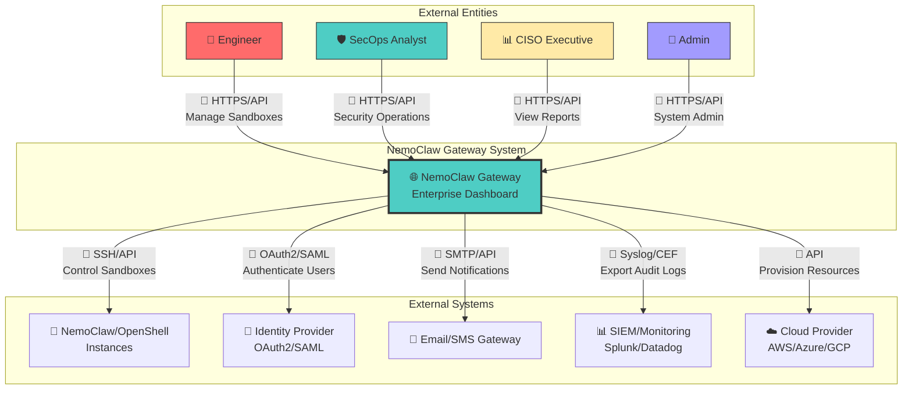
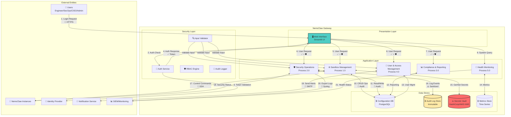
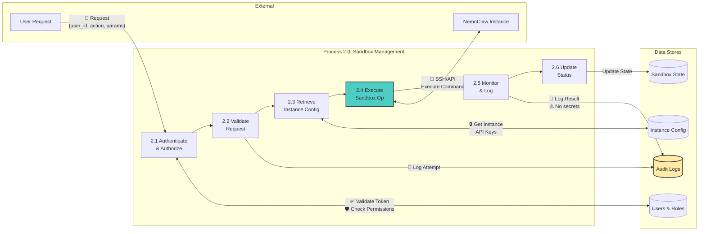
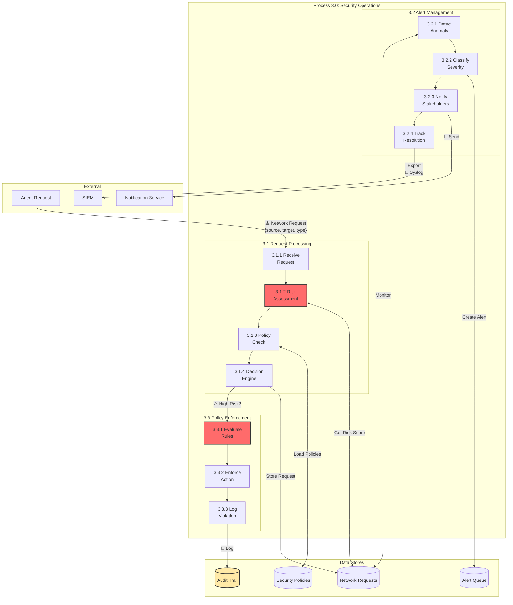
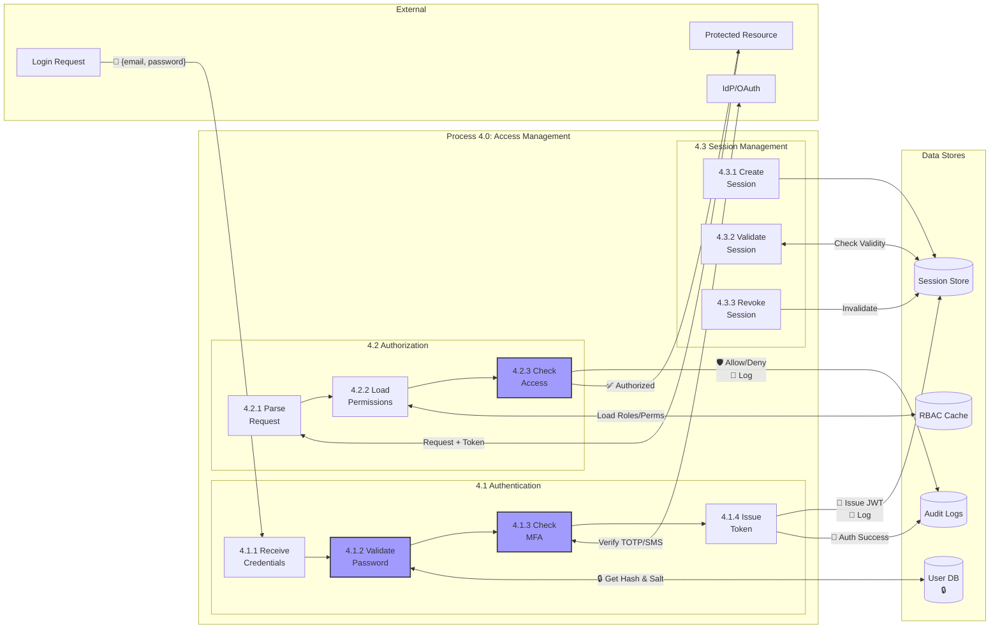
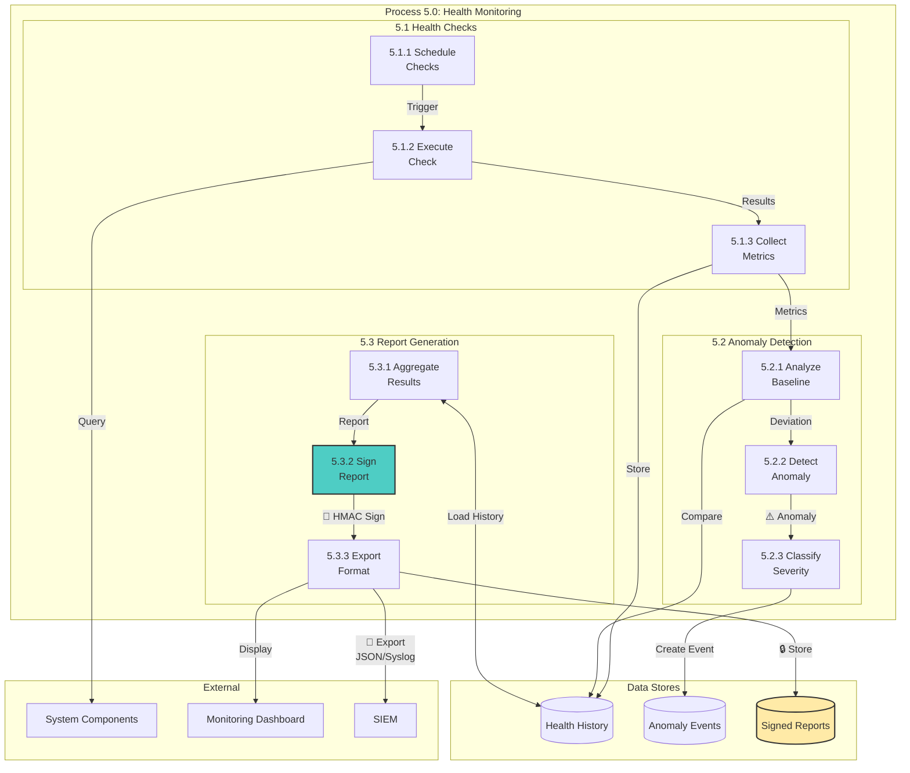
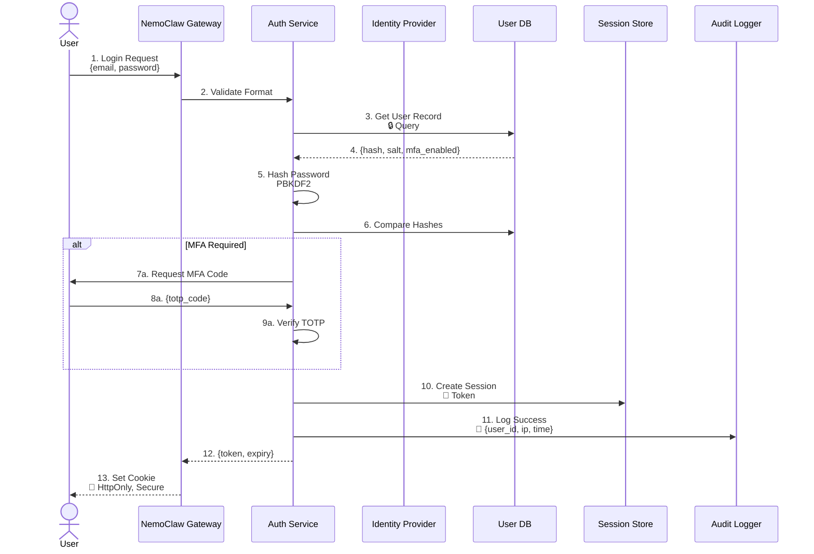
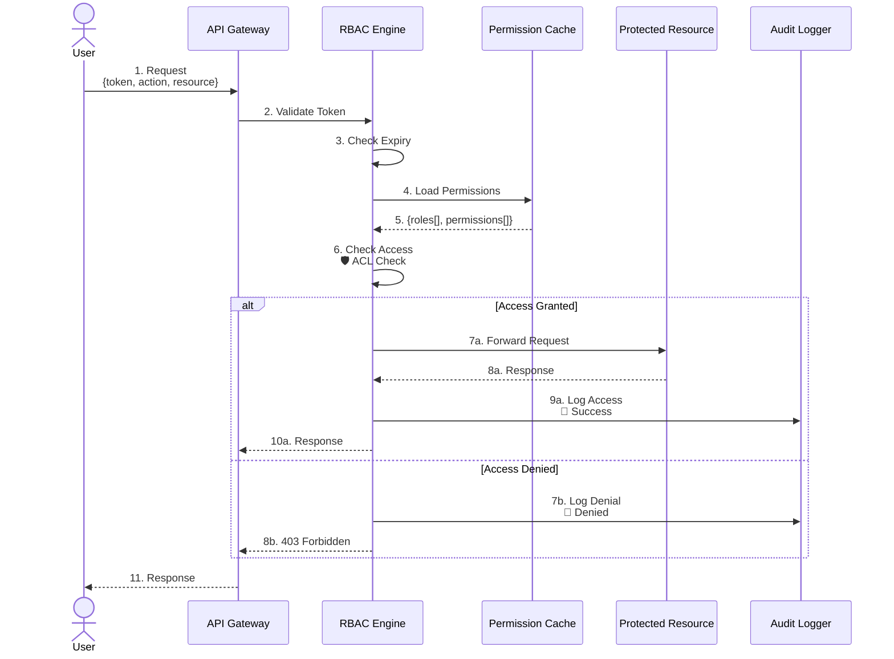
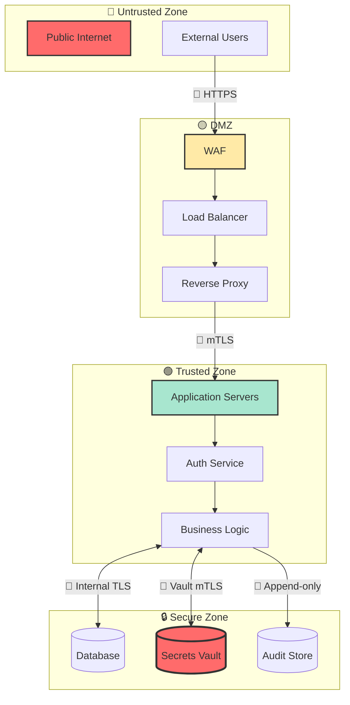

# NemoClaw Enterprise Command Center - Data Flow Diagrams (DFD)

**Version**: 2.1.0  
**Classification**: Internal Use  
**Last Updated**: March 27, 2026

---

## 🎯 Overview

This document contains comprehensive Data Flow Diagrams (DFD) at three levels:
- **Level 0**: Context Diagram - System boundary and external interactions
- **Level 1**: System Decomposition - Major processes and data stores
- **Level 2**: Detailed Processes - Sub-process breakdown with security controls

**Security Legend:**
- 🔒 = Encryption at rest
- 🔐 = Encryption in transit (TLS 1.3)
- ✅ = Authentication required
- 🛡️ = Authorization check
- 📝 = Audit logging
- ⚠️ = Sensitive data

---

## Level 0: Context Diagram

### System Context



### Level 0 Data Flows

| Flow | From | To | Data | Security |
|------|------|-----|------|----------|
| F1 | Engineer | Gateway | Sandbox commands, config | 🔐 TLS 1.3, ✅ Auth, 🛡️ RBAC |
| F2 | SecOps | Gateway | Security actions, approvals | 🔐 TLS 1.3, ✅ Auth, 🛡️ RBAC, 📝 Audit |
| F3 | CISO | Gateway | Report queries | 🔐 TLS 1.3, ✅ Auth, 🛡️ RBAC |
| F4 | Admin | Gateway | System configuration | 🔐 TLS 1.3, ✅ Auth, 🛡️ Admin only, 📝 Audit |
| F5 | Gateway | NemoClaw | Instance control | 🔐 SSH/API keys, ✅ Service auth |
| F6 | Gateway | IdP | Auth tokens | 🔐 OAuth2/SAML, ✅ MFA |
| F7 | Gateway | Email Gateway | Alerts, notifications | 🔐 SMTP TLS, ⚠️ Email addresses |
| F8 | Gateway | SIEM | Audit logs, events | 🔐 Syslog TLS/CEF, ⚠️ Sanitized data |
| F9 | Gateway | Cloud Provider | Resource provisioning | 🔐 API tokens, ✅ IAM roles |

---

## Level 1: System Decomposition

### Major Processes



### Level 1 Process Descriptions

| Process ID | Name | Description | Security Controls |
|------------|------|-------------|-------------------|
| **P1.0** | Web Interface | Streamlit-based UI layer | 🔐 HTTPS, S4 Input Validation |
| **P2.0** | Sandbox Management | Create, start, stop, monitor sandboxes | ✅ Auth, 🛡️ RBAC, 📝 Audit, 🔐 SSH to instances |
| **P3.0** | Security Operations | Request queue, alerts, policy enforcement | ✅ Auth, 🛡️ RBAC, 📝 Audit, 🔐 API tokens |
| **P4.0** | Compliance & Reporting | Audit trails, compliance tracking | ✅ Auth, 🛡️ RBAC, ⚠️ Data classification |
| **P5.0** | Health Monitoring | Self-assessment, anomaly detection | 🔍 Internal only, 📝 Audit, 🔐 Signed reports |
| **P6.0** | User & Access Management | Authentication, authorization, SSO | ✅ Auth, 🛡️ Admin only, 🔐 MFA, 📝 Audit |

### Level 1 Data Stores

| Store ID | Name | Type | Security |
|----------|------|------|----------|
| **D1** | Configuration DB | PostgreSQL | 🔒 Encryption at rest, 🔐 TLS connections, Row-level security |
| **D2** | Audit Log Store | Append-only, signed | 🔒 Immutable, 📝 Signed with HMAC, ⚠️ Sanitized |
| **D3** | Secrets Vault | HashiCorp Vault/AWS KMS | 🔒 Encrypted, 🔐 mTLS, Access logging, Rotation |
| **D4** | Metrics Store | Time-series (Influx/Prometheus) | 🔒 Encrypted, Retention policies, Aggregation |

---

## Level 2: Detailed Process Decomposition

### Process 2.0: Sandbox Management (Detailed)



#### Process 2.0 Data Flows

| Flow | From | To | Data Elements | Security |
|------|------|-----|---------------|----------|
| 2.1 | User | 2.1 | `user_id`, `action`, `sandbox_id`, `params` | 🔐 HTTPS, S4 validation |
| 2.2 | 2.1 | D1 | `token`, `required_permission` | 🔒 Query |
| 2.3 | D1 | 2.1 | `user_valid`, `permissions[]` | 🔒 Response |
| 2.4 | 2.2 | D4 | `timestamp`, `user_id`, `action`, `ip` | 📝 Audit log |
| 2.5 | 2.3 | D2 | `instance_id` | 🔒 Query |
| 2.6 | D2 | 2.3 | `instance_config`, `api_key_ref` | 🔒 Response, ⚠️ Key reference only |
| 2.7 | 2.3 | D3 | `api_key` | 🔐 Vault lookup, ⚠️ In-memory only |
| 2.8 | 2.4 | E2 | `command`, `credentials` | 🔐 SSH with key |
| 2.9 | E2 | 2.4 | `result`, `status`, `logs` | 🔐 SSH return |
| 2.10 | 2.5 | D4 | `timestamp`, `result_status`, `duration` | 📝 Audit log, ⚠️ Sanitized |
| 2.11 | 2.6 | D3 | `sandbox_id`, `new_status` | 🔒 State update |

---

### Process 3.0: Security Operations (Detailed)



---

### Process 4.0: User & Access Management (Detailed)



---

### Process 5.0: Health Monitoring (Detailed)



---

## Security Control Mapping

### Authentication Flow



### Authorization Check



---

## Trust Boundaries

### Trust Zones



### Data Classification

| Classification | Examples | Storage | Transmission |
|----------------|----------|---------|--------------|
| **Public** | Documentation, marketing | Unencrypted | HTTPS |
| **Internal** | Configs, non-sensitive logs | 🔒 Encrypted | 🔐 HTTPS |
| **Confidential** | User data, sandbox configs | 🔒 Encrypted + Access Control | 🔐 HTTPS + mTLS |
| **Restricted** | Passwords, API keys, tokens | 🔒 Vault + Encryption | 🔐 Never in transit (references only) |
| **Audit** | Security events, compliance | 🔒 Immutable + Signed | 🔐 Syslog TLS |

---

## Data Flow Security Matrix

| Flow | Source | Destination | Classification | Encryption | Auth | Audit |
|------|--------|-------------|----------------|------------|------|-------|
| User Login | Browser | Gateway | Restricted | 🔐 TLS 1.3 | ✅ MFA | 📝 Yes |
| API Calls | Browser | Gateway | Confidential | 🔐 TLS 1.3 | ✅ Token | 📝 Yes |
| Instance Control | Gateway | NemoClaw | Confidential | 🔐 SSH/API | ✅ Key | 📝 Yes |
| Database Queries | Gateway | PostgreSQL | Confidential | 🔐 TLS | ✅ Service | 📝 Query logs |
| Secret Retrieval | Gateway | Vault | Restricted | 🔐 mTLS | ✅ Token | 📝 Access logs |
| Audit Export | Gateway | SIEM | Audit | 🔐 Syslog TLS | ✅ Cert | 📝 N/A |
| Notifications | Gateway | Email | Confidential | 🔐 SMTP TLS | ✅ API Key | 📝 Sent logs |

---

## Diagram Update Process

### Version Control

All DFD diagrams are version controlled with the following metadata:

```yaml
# dfd-version.yaml
document: NemoClaw_Gateway_DFD
version: 2.1.0
last_updated: 2024-03-27T00:00:00Z
author: Architecture Team
reviewers:
  - security_lead
  - principal_engineer
changes:
  - id: DFD-2024-001
    date: 2024-03-27
    description: Added Process 5.0 Health Monitoring
    author: dev_team
    approved_by: security_lead
```

### Review Checklist

- [ ] All external entities identified
- [ ] All processes have security controls marked
- [ ] Data classifications applied
- [ ] Trust boundaries clearly defined
- [ ] No sensitive data in diagram labels
- [ ] All flows have encryption noted
- [ ] Audit points identified
- [ ] Version metadata updated

---

**Classification**: Internal Use  
**Owner**: Security Architecture Team  
**Review Cycle**: Quarterly  
**Next Review**: June 27, 2026
